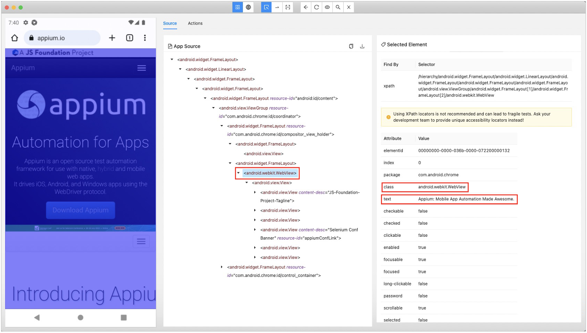

# webTitleセレクター

## webTitleセレクター

**webTitleセレクター** はブラウザ内の画面を識別するためのスペシャルセレクターです。

Google Chromeで "https://appium.io/" を開き、これをAppium Inspectorで見てみましょう。



**webTitleセレクター** は以下のように使用することができます。

```
~webTitle=Appium: Mobile App Automation Made Awesome.
```

**webTitleセレクター** は実行時に以下のように展開されます。

```
.android.webkit.WebView&&Appium: Mobile App Automation Made Awesome.
```

展開のルールはテストフレームワークに組み込まれています。
このルールはtestrunファイルでオーバーライドできます。

```properties
android.webTitleSelector=.android.webkit.WebView&&${webTitle}
ios.webTitleSelector=<.XCUIElementTypeWebView>:descendant(${webTitle}&&visible=*)
```

### Link

- [titleセレクター](title_selector_ja.md)
- [index](../../../index_ja.md)

