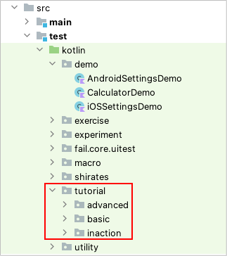

# チュートリアルのサンプル

[shirates-core](https://github.com/ldi-github/shirates-core/) の`src/test/kotlin`ディレクトリ内のサンプルコードを参照して実行できます。

また、[shirates-coreのサンプル（日本語版）](https://github.com/ldi-github/shirates-core-samples-ja) を入手することができます。

これらのサンプルコードを参照して実行しながらチュートリアルを読み進めてください。

### Link

- [index](../index_ja.md)
