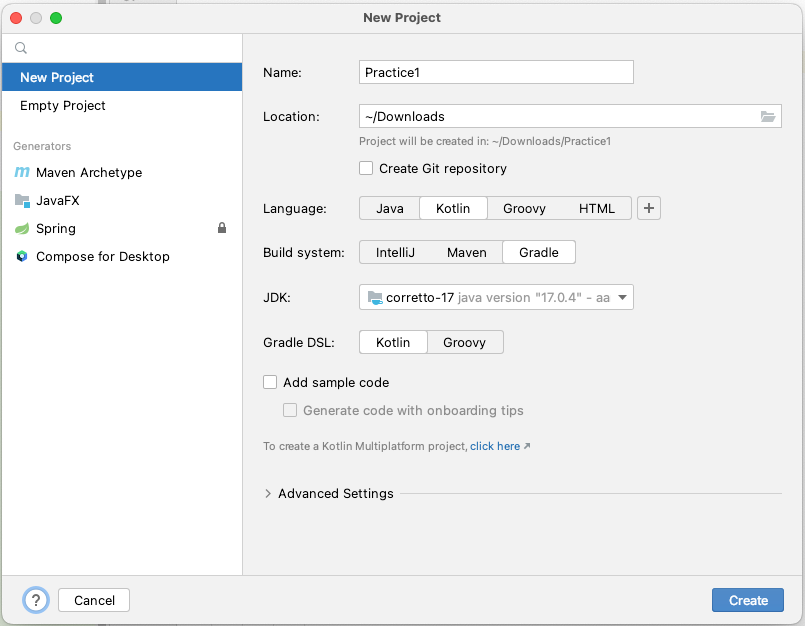
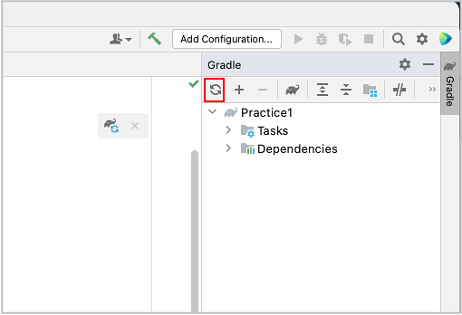

# Creating project (Classic)

## Create new project

1. Open IntelliJ IDEA, select `File > New > Project`.
1. In New Project window, select `New Project` tab.
1. Input fields.
    - `Name: Practice1`
    - `Location: (Your location)`
    - `Language: Kotlin`
    - `Build system: Gradle`
    - `JDK: (Your choice)`
    - `Gradle DSL: Kotlin`
    - `Add sample code: OFF`
      <br>
1. Click `Create`.
1. Wait for a while until background tasks finish. It may take minutes.
1. Edit `build.gradle.kts` as follows.

### build.gradle.kts (after edit)

```kotlin
plugins {
    kotlin("jvm") version "1.9.23"
}

group = "org.example"
version = "1.0-SNAPSHOT"

repositories {
    mavenCentral()
}

val shiratesCoreVersion = "6.8.0"
val appiumClientVersion = "9.1.0"

dependencies {

    // JUnit 5
    testImplementation("org.junit.jupiter:junit-jupiter-api:5.10.1")
    testRuntimeOnly("org.junit.jupiter:junit-jupiter-engine:5.10.1")

    // Appium
    testImplementation("io.appium:java-client:$appiumClientVersion")

    // shirates-core
    testImplementation("io.github.ldi-github:shirates-core:$shiratesCoreVersion")
}

tasks.test {
    useJUnitPlatform()
}

kotlin {
    jvmToolchain(17)
}
```

Click reload on Gradle pane.



### Link

- [index](../../index.md)

