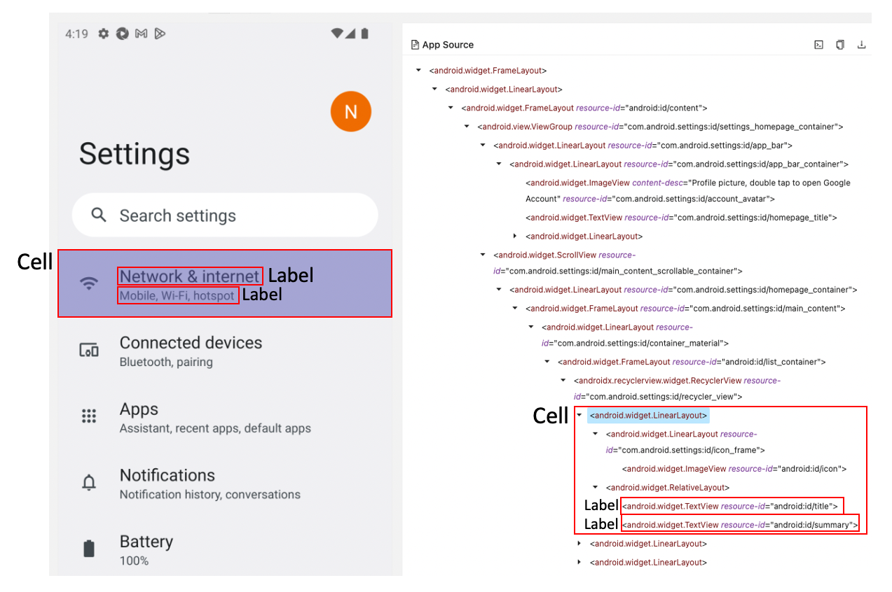
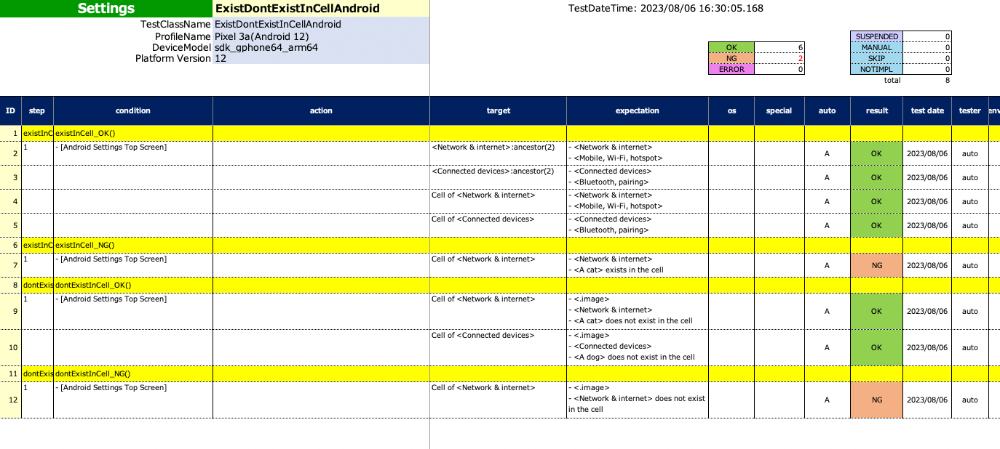
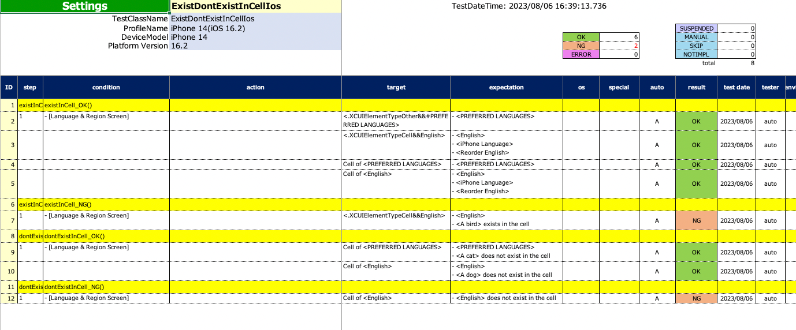

# セルの内部に要素が存在することの検証 (Classic)

これらの関数を使用してセルの内部に要素が存在することを確認できます。

## 関数

| 関数     | 説明                   | return value |
|:-------|:---------------------|:-------------|
| cell   | セレクター式を使用してセルを選択します。 | TestElement  |
| cellOf | メンバー要素を指定してセルを選択します。 | TestElement  |

## セル

**セル** はアイテムのコンテナです。
例えばスクロール可能なビューの中の各行がこれに該当します。



## Example(Android)

### ExistDontExist1.kt

(`kotlin/tutorial/basic/ExistDontExistInCellAndroid.kt`)

```kotlin
package tutorial.basic

import org.junit.jupiter.api.Order
import org.junit.jupiter.api.Test
import shirates.core.configuration.Testrun
import shirates.core.driver.commandextension.*
import shirates.core.testcode.UITest

@Testrun("testConfig/android/androidSettings/testrun.properties")
class ExistDontExistInCellAndroid : UITest() {

    @Test
    @Order(10)
    fun exist_in_cellOf_OK() {

        scenario {
            case(1) {
                condition {
                    it.macro("[Android Settings Top Screen]")
                }.expectation {
                    it.cell("<Network & internet>:ancestor(2)") {
                        exist("Network & internet")
                        exist("Mobile, Wi‑Fi, hotspot")
                    }
                    it.cell("<Connected devices>:ancestor(2)") {
                        exist("Connected devices")
                        exist("Bluetooth, pairing")
                    }
                }
            }
            case(2) {
                expectation {
                    it.cellOf("Network & internet") {
                        exist("Network & internet")
                        exist("Mobile, Wi‑Fi, hotspot")
                    }
                    it.cellOf("Connected devices") {
                        exist("Connected devices")
                        exist("Bluetooth, pairing")
                    }
                }
            }
        }
    }

    @Test
    @Order(20)
    fun exist_in_cellOf_NG() {

        scenario {
            case(1) {
                condition {
                    it.macro("[Android Settings Top Screen]")
                }.expectation {
                    it.cellOf("Network & internet") {
                        exist("Network & internet")
                        exist("A cat")
                    }
                }
            }
        }
    }

    @Test
    @Order(30)
    fun dontExist_in_cellOf_OK() {

        scenario {
            case(1) {
                condition {
                    it.macro("[Android Settings Top Screen]")
                }.expectation {
                    it.cellOf("Network & internet") {
                        exist("Network & internet")
                        dontExist("A cat")
                    }
                    it.cellOf("Connected devices") {
                        exist("Connected devices")
                        dontExist("A dog")
                    }
                }
            }
        }
    }

    @Test
    @Order(40)
    fun dontExist_in_cellOf_NG() {

        scenario {
            case(1) {
                condition {
                    it.macro("[Android Settings Top Screen]")
                }.expectation {
                    it.cellOf("Network & internet") {
                        dontExist("Network & internet")
                    }
                }
            }
        }
    }

}
```

### SpecReport



## Example(iOS)

### ExistDontExistInCellIos.kt

(`kotlin/tutorial/basic/ExistDontExistInCellIos.kt`)

```kotlin
package tutorial.basic

import org.junit.jupiter.api.Order
import org.junit.jupiter.api.Test
import shirates.core.configuration.Testrun
import shirates.core.driver.commandextension.*
import shirates.core.testcode.UITest

@Testrun("testConfig/ios/iOSSettings/testrun.properties")
class ExistDontExistInCellIos : UITest() {

    @Test
    @Order(10)
    fun exist_in_cell_OK() {

        scenario {
            case(1) {
                condition {
                    it.macro("[Language & Region Screen]")
                }.expectation {
                    it.cell(".XCUIElementTypeCell&&value=iPhone Language") {
                        exist("English")
                        exist("iPhone Language")
                    }
                }
            }
            case(2) {
                expectation {
                    it.cellOf("iPhone Language") {
                        exist("English")
                        exist("iPhone Language")
                    }
                }
            }
        }
    }

    @Test
    @Order(20)
    fun exist_in_cell_NG() {

        scenario {
            case(1) {
                condition {
                    it.macro("[Language & Region Screen]")
                }.expectation {
                    it.cellOf("iPhone Language") {
                        exist("English")
                        exist("A cat")
                    }
                }
            }
        }
    }

    @Test
    @Order(30)
    fun dontExist_in_cell_OK() {

        scenario {
            case(1) {
                condition {
                    it.macro("[Language & Region Screen]")
                }.expectation {
                    it.cellOf("iPhone Language") {
                        dontExist("A dog")
                    }
                }
            }
        }
    }

    @Test
    @Order(40)
    fun dontExist_in_cell_NG() {

        scenario {
            case(1) {
                condition {
                    it.macro("[Language & Region Screen]")
                }.expectation {
                    it.cellOf("iPhone Language") {
                        dontExist("English")
                    }
                }
            }
        }
    }

}
```

### SpecReport



### Link

- [index](../../../index_ja.md)
