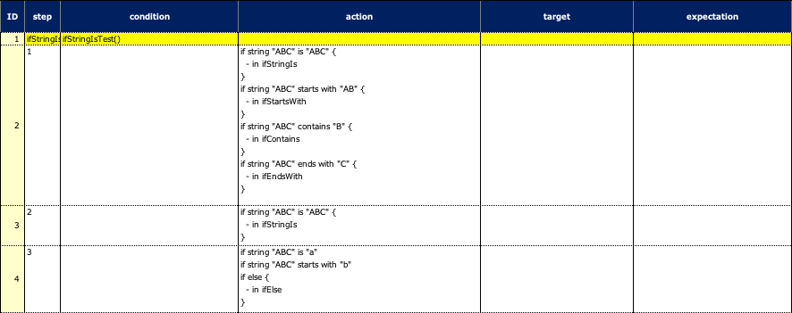

# Branch function (ifStringIs, ifStartsWith, etc) (Classic)

You can use branch functions for string.

## functions

| function         | description                                                                                                                         |
|:-----------------|:------------------------------------------------------------------------------------------------------------------------------------|
| ifStringIs       | The code block is executed if specified string is value.                                                                            |
| ifStartsWith     | The code block is executed if specified string starts with value.                                                                   |
| ifContains       | The code block is executed if specified string contains value.                                                                      |
| ifEndsWith       | The code block is executed if specified string ends with value.                                                                     |
| ifMatches        | The code block is executed if specified string matches the regular expression                                                       |
| elseIfStringIs   | The code block is executed if specified string is value on all of the preceding conditions do not match.                            |
| elseIfStartsWith | The code block is executed if specified string starts with value on all of the preceding conditions do not match.                   |
| elseIfContains   | The code block is executed if specified string contains value on all of the preceding conditions do not match.                      |
| elseIfEndsWith   | The code block is executed if specified string ends with value on all of the preceding conditions do not match.                     |
| elseIfMatches    | The code block is executed if specified string matches with the regular expression on all of the preceding conditions do not match. |
| ifElse           | The code block is executed on all of the preceding conditions do not match.                                                         |

### IfStringIs1.kt

(`kotlin/tutorial/basic/IfStringIs1.kt`)

```kotlin
package tutorial.basic

import org.junit.jupiter.api.Order
import org.junit.jupiter.api.Test
import shirates.core.configuration.Testrun
import shirates.core.driver.branchextension.ifStringIs
import shirates.core.driver.commandextension.describe
import shirates.core.testcode.UITest

@Testrun("testConfig/android/androidSettings/testrun.properties")
class IfStringIs1 : UITest() {

    @Test
    @Order(10)
    fun ifStringIsTest() {

        scenario {
            case(1) {
                action {
                    "ABC".ifStringIs("ABC") {
                        describe("in ifStringIs")   // executed
                    }.ifStartsWith("AB") {
                        describe("in ifStartsWith") // executed
                    }.ifContains("B") {
                        describe("in ifContains")   // executed
                    }.ifEndsWith("C") {
                        describe("in ifEndsWith")   // executed
                    }.ifElse {
                        describe("in ifElse")   // NOT executed
                    }
                }
            }
            case(2) {
                action {
                    "ABC".ifStringIs("ABC") {
                        describe("in ifStringIs")   // executed
                    }.elseIfContains("AB") {
                        describe("in ifStartsWith") // NOT executed
                    }.elseIfContains("B") {
                        describe("in ifContains")   // NOT executed
                    }.elseIfContains("C") {
                        describe("in ifEndsWith")   // NOT executed
                    }.ifElse {
                        describe("in ifElse")   // NOT executed
                    }
                }
            }
            case(3) {
                action {
                    "ABC".ifStringIs("a") {
                        describe("in ifStringIs")   // NOT executed
                    }.ifStartsWith("b") {
                        describe("in ifStartsWith") // NOT executed
                    }.ifElse {
                        describe("in ifElse")   // executed
                    }
                }
            }
        }
    }

}
```

### Spec-Report(Normal mode)



### Link

- [index](../../../index.md)

