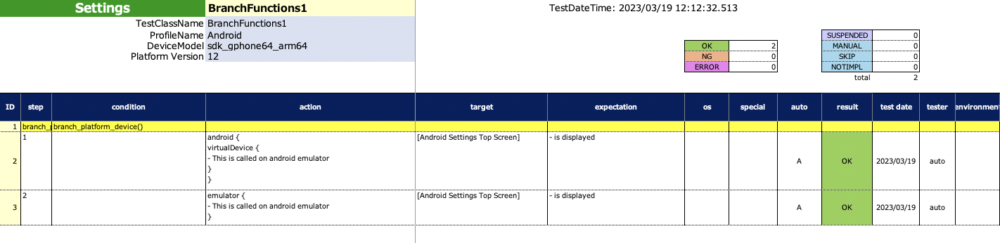
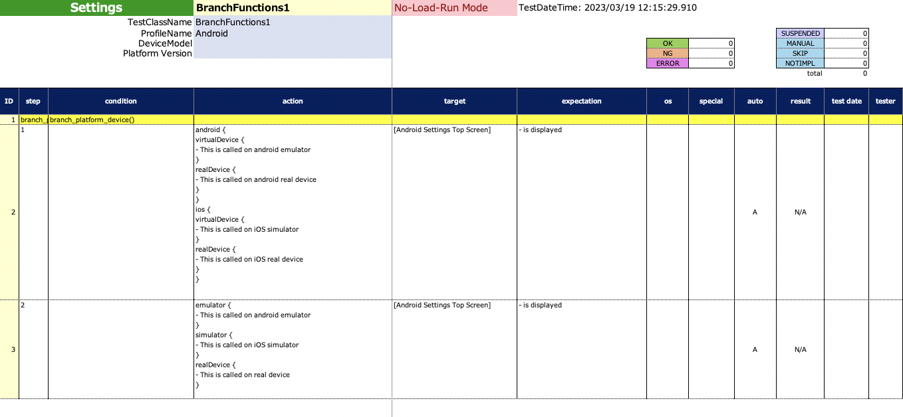

# プラットフォーム関数 (Classic)

テストにおける特定の状況下では条件分岐が必要となります。
これらのプラットフォーム関数を使用することができます。

## 関数

| 関数            | 説明                               |
|:--------------|:---------------------------------|
| android       | Androidの場合にコードブロックが実行されます        |
| ios           | iOSの場合にコードブロックが実行されます            |
| emulator      | Androidエミュレーターの場合にコードブロックが実行されます |
| simulator     | iOSシミュレーターの場合にコードブロックが実行されます     |
| virtualDevice | 仮想デバイスの場合にコードブロックが実行されます         |
| realDevice    | 実デバイスの場合にコードブロックが実行されます          |

## 例

### BranchFunctions1.kt

(`kotlin/tutorial/basic/BranchFunctions1.kt`)

```kotlin
package tutorial.basic

import org.junit.jupiter.api.Order
import org.junit.jupiter.api.Test
import shirates.core.configuration.Testrun
import shirates.core.driver.branchextension.*
import shirates.core.driver.commandextension.describe
import shirates.core.driver.commandextension.screenIs
import shirates.core.testcode.UITest

@Testrun("testConfig/android/androidSettings/testrun.properties", profile = "Android")
class BranchFunctions1 : UITest() {

    @Test
    @Order(10)
    fun branch_platform_device() {

        scenario {
            case(1) {
                action {
                    android {
                        virtualDevice {
                            describe("This is called on android emulator")
                        }
                        realDevice {
                            describe("This is called on android real device")
                        }
                    }
                    ios {
                        virtualDevice {
                            describe("This is called on iOS simulator")
                        }
                        realDevice {
                            describe("This is called on iOS real device")
                        }
                    }
                }.expectation {
                    it.screenIs("[Android Settings Top Screen]")
                }
            }
            case(2) {
                action {
                    emulator {
                        describe("This is called on android emulator")
                    }
                    simulator {
                        describe("This is called on iOS simulator")
                    }
                    realDevice {
                        describe("This is called on real device")
                    }
                }.expectation {
                    it.screenIs("[Android Settings Top Screen]")
                }
            }
        }
    }

}
```

### Spec-Report(通常モード)



### Spec-Report(無負荷実行モード)



### Link

- [index](../../../index_ja.md)

