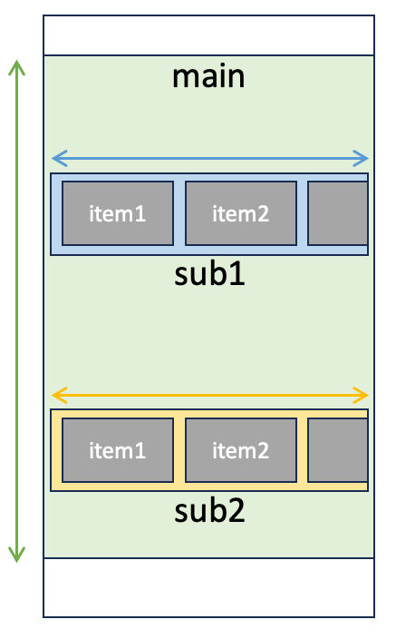

# スクロール可能領域の決定 (Classic)

scroll, swipe, flick等の関数を実行する際にはスクロール可能領域を決定し、その領域に対して操作を実行します。

## 暗黙的なスクロール可能領域の決定

スクロール可能領域を明示的に指定しない場合は以下の優先度でスクロール可能領域が決定されます。

1. 基準となる要素（前回アクセスされた要素）を含むスクロール可能領域
2. 画面内の最も大きなスクロール可能領域



### 例1

sub1要素をselectした状態でscrollRightを実行するとsub1要素がスクロール領域となります。

```kotlin
select("#sub1")
    .scrollRight()
```

### 例2

sub1要素の内部のitem1をselectした状態でscrollRightを実行するとsub1要素がスクロール領域となります。

```kotlin
select("#item1")
    .scrollRight()
```

### 例3

sub1要素またはsub2要素に属する要素をselectしていない状態でscrollDownを実行するとmain要素がスクロール領域となります。

```kotlin
view.scrollDown()
```

<br>
<hr>

## 明示的なスクロール可能領域の決定

スクロール可能領域を明示的に指定する方法としては以下のものがあります。

- scroll関数の引数で指定する
- withScroll関数で指定する
- 画面ニックネームで指定する

### 例4

scrollDown関数でscrollFrame引数を指定します。

```kotlin
scrollDown(scrollFrame = "#main")
```

### 例5

withScrollDown関数でscrollFrame引数を指定します。

```kotlin
withScrollDown(scrollFrame = "#main") {
    select("something")
}
```

### 例6

画面ニックネームで scroll-frame
を指定します。([画面ニックネーム](../../selector_and_nickname/nickname/screen_nickname_ja.md))

```json
  "selectors": {
    "[Scroll Area]": "@a<#recycler>,@i<.XCUIElementTypeTable>"
  },
  "scroll": {
    "scroll-frame": "[Scroll Area]"
  }
```

<br>
<hr>

## Example Code

### Scroll3.kt

(`kotlin/tutorial/basic/Scroll3.kt`)

```kotlin
package tutorial.basic

import org.junit.jupiter.api.Order
import org.junit.jupiter.api.Test
import shirates.core.configuration.Testrun
import shirates.core.driver.commandextension.*
import shirates.core.driver.view
import shirates.core.testcode.UITest

@Testrun("testConfig/android/maps/testrun.properties")
class Scroll3 : UITest() {

    @Test
    @Order(10)
    fun scrollRight_scrollLeft_implicitly1() {

        scenario {
            case(1) {
                condition {
                    it.macro("[Maps Top Screen]")
                }.expectation {
                    select("#below_search_omnibox_container")
                        .existWithScrollRight("More")
                }
            }
            case(2) {
                expectation {
                    select("#below_search_omnibox_container")
                        .existWithScrollLeft("Restaurants")
                }
            }
        }
    }

    @Test
    @Order(20)
    fun scrollRight_scrollLeft_implicitly2() {

        scenario {
            case(1) {
                condition {
                    it.macro("[Maps Top Screen]")
                }.expectation {
                    select("Restaurants")
                        .existWithScrollRight("More")
                }
            }
            case(2) {
                expectation {
                    existWithScrollLeft("Restaurants")
                }
            }
        }
    }

    @Test
    @Order(30)
    fun scrollRight_scrollLeft_implicitly3() {

        scenario {
            case(1) {
                condition {
                    it.macro("[Maps Top Screen]")
                }.action {
                    view.scrollRight()
                        .scrollLeft()
                }
            }
        }
    }

    @Test
    @Order(40)
    fun scrollDown_scrollUp_explicitly1() {

        scenario {
            case(1) {
                condition {
                    it.macro("[Maps Top Screen]")
                        .tapWithScrollRight("More", scrollFrame = "#recycler_view")
                }.action {
                    scrollDown(scrollFrame = "#explore_modules_list_layout_recyclerView")
                    scrollUp(scrollFrame = "#explore_modules_list_layout_recyclerView")
                }
            }
            case(2) {
                expectation {
                    withScrollDown(scrollFrame = "#explore_modules_list_layout_recyclerView") {
                        exist("Car wash")
                    }
                    withScrollUp(scrollFrame = "#explore_modules_list_layout_recyclerView") {
                        existWithoutScroll("Dry cleaning")
                        exist("Coffee")
                    }
                }
            }
        }
    }

}
```

### Link

- [index](../../../index_ja.md)

