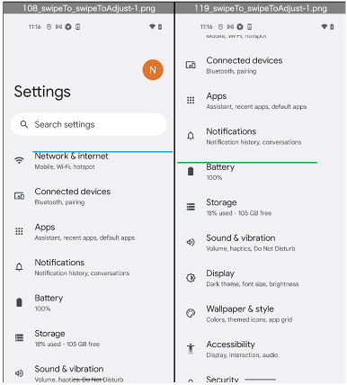
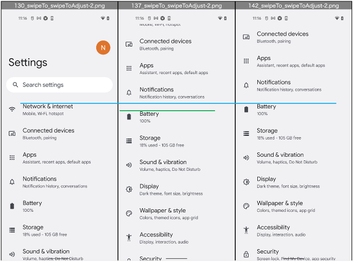

# swipe, flick (Classic)

これらの関数を使用して画面をスワイプまたはフリックすることができます。

## 関数

| スワイプ関数                      | 説明                          | フリック関数                                                |
|:----------------------------|:----------------------------|:------------------------------------------------------|
| swipeTo                     | 要素を他の要素の位置までスワイプします         | n/a                                                   |
| swipeToAdjust               | 要素を他の要素の位置までスワイプします（位置調整あり） | n/a                                                   |
| swipeVerticalTo             | 要素を指定したy座標まで垂直にスワイプします      | n/a                                                   |
| swipeHorizontalTo           | 要素を指定したx座標まで水平にスワイプします      | n/a                                                   |
| swipeToTop                  | 要素を画面の上までスワイプします            | flickToTop                                            |
| swipeToRight                | 要素を画面の右までスワイプします            | flickToRight                                          |
| swipeToBottom               | 要素を画面の下までスワイプします            | flickToBottom                                         |
| swipeToLeft                 | 要素を画面の左までスワイプします            | flickToLeft                                           |
| swipeToCenter               | 要素をスクロールエリアの中心までスワイプします     | n/a                                                   |
| swipeToCenterOfScreen       | 要素を画面の中心までスワイプします           | n/a                                                   |
| swipeCenterToTop            | 画面の中心から上へスワイプします            | flickCenterToTop                                      |
| swipeCenterToRight          | 画面の中心から右へスワイプします            | flickCenterToRight                                    |
| swipeCenterToBottom         | 画面の中心から下へスワイプします            | flickCenterToBottom                                   |
| swipeCenterToLeft           | 画面の中心から左へスワイプします            | flickCenterToLeft                                     |
| swipeLeftToRight            | 画面の左から右へスワイプします             | flickLeftToRight                                      |
| swipeRightToLeft            | 画面の右から左へスワイプします             | flickRightToLeft                                      |
| swipeBottomToTop            | 画面の下から上へスワイプします             | flickBottomToTop, flickAndGoDown, flickAndGoDownTurbo |
| swipeTopToBottom            | 画面の上から下へスワイプします             | flickTopToBottom, flickAndGoUp, flickAndGoUpTurbo     |
| swipePointToPoint           | 画面上の開始座標から終了座標へスワイプします      | n/a                                                   |
| swipeElementToElement       | 要素を他の要素の位置までスワイプします         | n/a                                                   |
| swipeElementToElementAdjust | 要素を他の要素の位置までスワイプします（位置調整あり） | n/a                                                   |

## swipeTo, swipeToAdjust

### Swipe1.kt

(`kotlin/tutorial/basic/Swipe1.kt`)

```kotlin
    @Test
    @Order(10)
    fun swipeTo_swipeToAdjust() {

        scenario {
            case(1) {
                condition {
                    it.macro("[Android Settings Top Screen]")
                }.action {
                    it.select("[Battery]")
                        .swipeTo("[Network & internet]")
                }.expectation {
                }
            }
            case(2) {
                condition {
                    it.macro("[Android Settings Top Screen]")
                }.action {
                    it.select("[Battery]")
                        .swipeToAdjust("[Network & internet]")
                }.expectation {
                }
            }
        }
    }
```

**swipeTo** は正確ではないですが速いです。



**swipeToAdjust** はより正確ですが遅いです。



## swipeToCenter, swipeToTop, swipeToBottom

### Swipe1.kt

(`kotlin/tutorial/basic/Swipe1.kt`)

```kotlin
    @Test
    @Order(20)
    fun swipeToCenter_swipeToTop_swipeToBottom() {

        scenario {
            case(1) {
                condition {
                    it.macro("[Android Settings Top Screen]")
                        .exist("[Notifications]")
                        .exist("[Battery]")
                }.action {
                    it.select("[Battery]")
                        .swipeToCenterOfScreen()
                        .swipeToTopOfScreen(durationSeconds = 10.0)
                }.expectation {
                    it.dontExist("[Notifications]")
                        .exist("[Storage]")
                }
            }
            case(2) {
                condition {
                    it.exist("[Security & privacy]")
                        .exist("[Location]")
                }.action {
                    it.select("[Security & privacy]")
                        .swipeToBottomOfScreen(durationSeconds = 10.0)
                }.expectation {
                    it.exist("[Security & privacy]")
                        .dontExist("[Location]")
                }
            }
        }
    }
```

## swipePointToPoint

### Swipe1.kt

(`kotlin/tutorial/basic/Swipe1.kt`)

```kotlin
    @Test
    @Order(30)
    fun swipePointToPoint() {

        scenario {
            case(1) {
                condition {
                    it.macro("[Android Settings Top Screen]")
                }.action {
                    it.swipePointToPoint(
                        startX = viewBounds.centerX,
                        startY = viewBounds.centerY,
                        endX = viewBounds.centerX,
                        endY = viewBounds.top
                    )
                }.expectation {

                }
            }

            case(2) {
                action {
                    it.swipePointToPoint(
                        startX = viewBounds.centerX,
                        startY = viewBounds.centerY,
                        endX = viewBounds.centerX,
                        endY = viewBounds.bottom,
                        durationSeconds = 0.2
                    )
                }.expectation {

                }
            }
        }
    }
```

**Swipe1.kt** にはより豊富なサンプルがあるのでソースコードを参照してください。

### Link

- [index](../../../index_ja.md)
