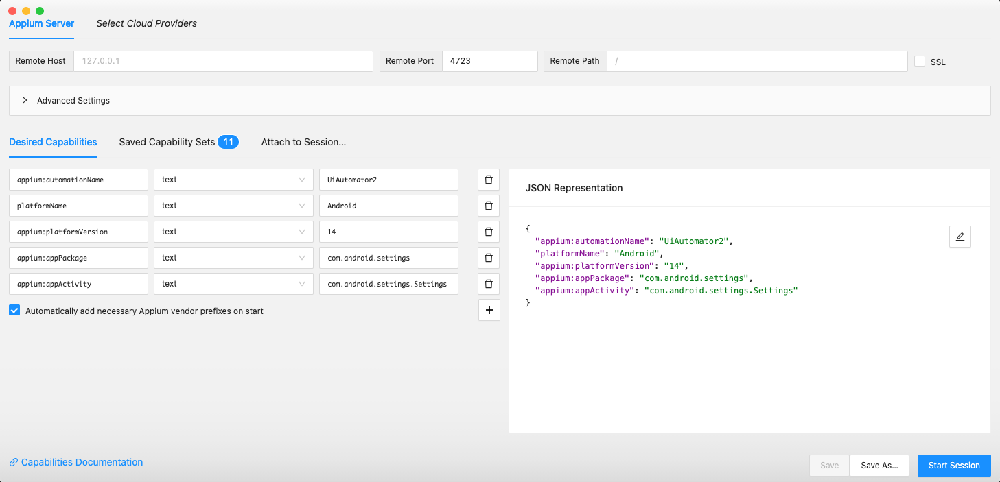
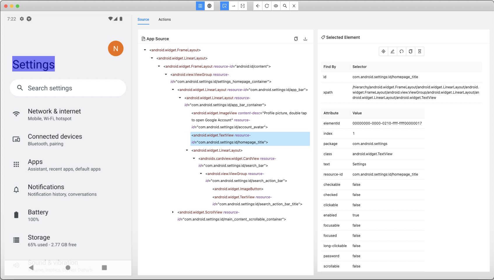
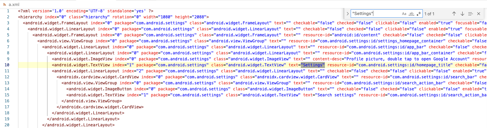

# Appium Inspectorを使用する (Classic)

画面ニックネームを作成したい場合、要素の情報を調査するために **Appium Inspector** を使用します。

## インストール

1. [appium/appium-inspector](https://github.com/appium/appium-inspector/releases)からインストールパッケージを入手します。
    - `Appium-Inspector-mac-202x.x.x.dmg` (Mac用)
    - `Appium-Inspector-windows-202x.x.x.exe` (Windows用)
2. パッケージをインストールします。
3. Appium Inspectorを起動します。

## Appium Serverの起動

1. ターミナルを起動します。
2. Appium Serverのプロセスを起動します。 ```appium``` と入力してからEnterを入力してください。

```
wave1008@SNB-M1 ~ % appium
Last login: Sun Apr 14 22:48:21 on ttys003
wave1008@ip-192-168-10-101 ~ % appium
[Appium] Welcome to Appium v2.5.1 (REV 7f745d04d90eaec76c8d5830d6ce6a0d7db888b3)
[Appium] The autodetected Appium home path: /Users/wave1008/.appium
[Appium] Attempting to load driver uiautomator2...
[Appium] Attempting to load driver xcuitest...
[Appium] Requiring driver at /Users/wave1008/.appium/node_modules/appium-uiautomator2-driver/build/index.js
[Appium] Requiring driver at /Users/wave1008/.appium/node_modules/appium-xcuitest-driver/build/index.js
[Appium] AndroidUiautomator2Driver has been successfully loaded in 0.957s
[Appium] XCUITestDriver has been successfully loaded in 2.020s
[Appium] Appium REST http interface listener started on http://0.0.0.0:4723
[Appium] You can provide the following URLs in your client code to connect to this server:
[Appium] 	http://127.0.0.1:4723/ (only accessible from the same host)
[Appium] 	http://192.168.10.101:4723/
[Appium] 	http://10.0.0.101:4723/
[Appium] 	http://192.168.30.10:4723/
[Appium] Available drivers:
[Appium]   - uiautomator2@3.0.4 (automationName 'UiAutomator2')
[Appium]   - xcuitest@7.5.1 (automationName 'XCUITest')
[Appium] No plugins have been installed. Use the "appium plugin" command to install the one(s) you want to use.
```

Appiumのインストールは[クイックスタート](../../quick-start_ja.md)を参照してください。

## Appium Inspectorの起動

1. Appium Inspectorを起動します。
2. `Desired Capabilities`タブを表示します。
3. パラメーターを以下のように編集します。
   <br><br>

```
{
  "appium:automationName": "UiAutomator2",
  "platformName": "Android",
  "appium:platformVersion": "14",
  "appium:appPackage": "com.android.settings",
  "appium:appActivity": "com.android.settings.Settings"
}
```

4. Android 14のエミュレーターを起動します。(Android 14用のAVDの設定については[クイックスタート](../../quick-start_ja.md))
   を参照してください。
5. `[Start Session]`をクリックします。
6. デバイス内で設定アプリが起動します。<br>画面イメージがキャプチャされます。画面要素を調査することができます。
   <br>

## ユニークになる属性を探す

画面要素を識別するにはユニークキーになる情報が必要です。外部のエディタを使用して作業することができます。

1. 調査したい画面をAppium Inspectorでキャプチャします。
2. `Copy XML Source to Clipboard`をクリックします。
   <br>
3. 好みのエディタを開いてペーストします。ユニークな属性を調査できます。
   <br>

### Link

- [画面ニックネームファイルの作成](creating_screen_nickname_file_ja.md)
- [Screen Builderを使用する](using_screen_builder.md)


- [index](../../index_ja.md)
