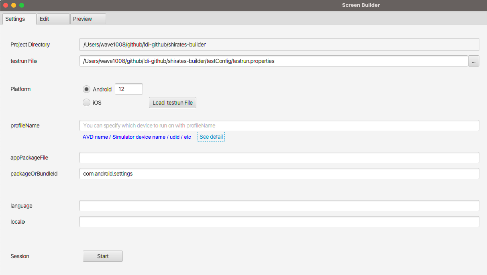
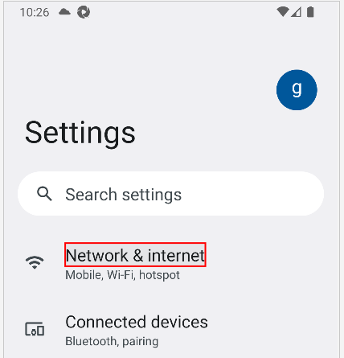

# Using Screen Builder (Classic)

You can make it easy to create screen nickname file with **Screen Builder**.


## Getting Screen Builder (Shirates Builder)

Get from GitHub repository.
https://github.com/ldi-github/shirates-builder

```
git clone https://github.com/ldi-github/shirates-builder.git
```

## Launching Screen Builder

1. Open `shirates-builder` project with IntelliJ IDEA.
2. Run app.<br>
   

## Starting recording session (in Settings tab)

1. Set `testrun File` field. Drag & Drop is available.<br>
   
2. Select platform (Android/iOS).
3. Click `[Load testrun File]`.
4. Set `packageOrBundleId`.
5. Click `[Start]` button to launch the device.

## Capturing screen (in Edit tab)

1. Click `[Capture]` button or `[Capture with scroll]` button.

## Preview JSON (in Preview tab)

1. See Preview tab.

## Defining Nicknames

1. Click an element on the image. It will be focused with red rectangle.<br>
   
2. You can edit the nickname.<br>
   

## Converting the element to relative selector

1. Click the base element to select. (red rectangle)
2. Ctrl+Click the element that you want to convert to relative element of the base element. (green rectangle)<br>
    <br><br>
   `{Network & internet}` is relative selector.<br>
   

### Link

- [Creating screen nickname file](creating_screen_nickname_file.md)
- [Using Appium Inspector](using_appium_inspector.md)


- [index](../../index.md)
