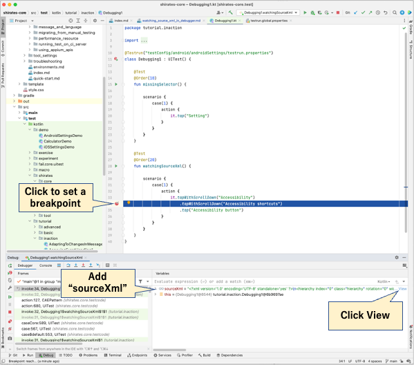
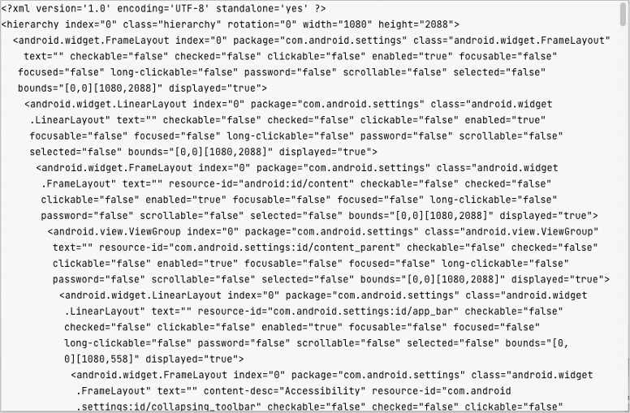

# Watching sourceXML in debugger (Classic)

You can watch sourceXML step by step in debugger.

## Example

### Debugging1.kt

(`kotlin/tutorial/inaction/Debugging1.kt`)

1. Click to set a breakpoint.
2. Add `sourceXml` in watch window.
3. Click `View`.  
   

You can see screen information in cache as XML.  

### Link

- [index](../../index.md)

