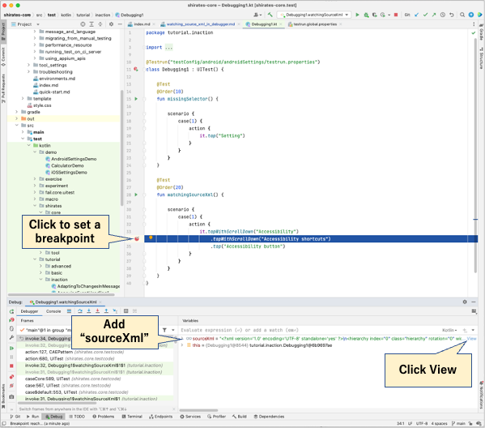

# ソースXMLをデバッガーで確認する (Classic)

デバッガを使用してステップバイステップでソースXMLを確認することができます。

## 例

### Debugging1.kt

(`kotlin/tutorial/inaction/Debugging1.kt`)

1. クリックしてブレークポイントを設定します。
2. ウォッチウィンドウに`sourceXml`を追加します。
3. `View`をクリックします。  
   

キャッシュされている画面情報のXMLを確認することができます。  

### Link

- [index](../../index_ja.md)

