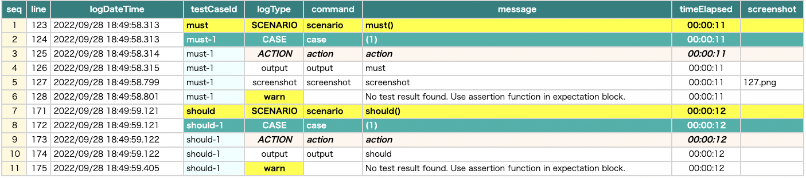

# 優先度アノテーションによるフィルター (@Must, @Should, @Want ) (Classic)

優先度アノテーション**@Must**,**@Should**,**@Want** をテスト関数に付与することができます。

## 例

### Priority1.kt

(`kotlin/tutorial/inaction/Priority1.kt`)

```kotlin
package tutorial.inaction

import org.junit.jupiter.api.Order
import org.junit.jupiter.api.Test
import shirates.core.configuration.Testrun
import shirates.core.driver.commandextension.output
import shirates.core.testcode.Must
import shirates.core.testcode.Should
import shirates.core.testcode.UITest
import shirates.core.testcode.Want

@Testrun("testConfig/android/androidSettings/testrun.properties")
class Priority1 : UITest() {

    @Must
    @Order(1)
    @Test
    fun must() {
        scenario {
            case(1) {
                action {
                    output("must")
                }
            }
        }
    }

    @Should
    @Order(2)
    @Test
    fun should() {
        scenario {
            case(1) {
                action {
                    output("should")
                }
            }
        }
    }

    @Want
    @Order(3)
    @Test
    fun want() {
        scenario {
            case(1) {
                action {
                    output("want")
                }
            }
        }
    }

    @Order(4)
    @Test
    fun none() {
        scenario {
            case(1) {
                action {
                    output("none")
                }
            }
        }
    }

}
```

### testrun.properties

テストが実行される際にどの優先度グループが実行されるか（あるいはされないか）を決定するフィルターを設定することができます。
優先度グループに対してフィルターをfalseに設定するとスキップされます。例えば以下のようにフィルターを設定できます。

```
## Priority filter --------------------
want=false
none=false
```

### 実行結果

- must -> 実行される
- should -> 実行される
- want -> スキップされる
- none -> スキップされる



### Link

- [index](../../index_ja.md)
