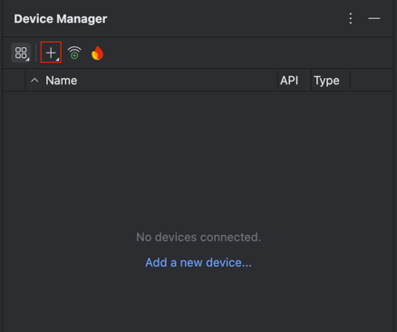
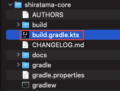
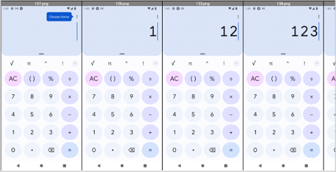
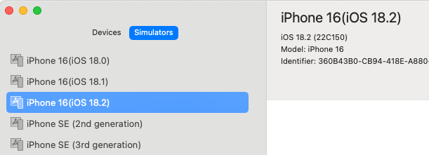
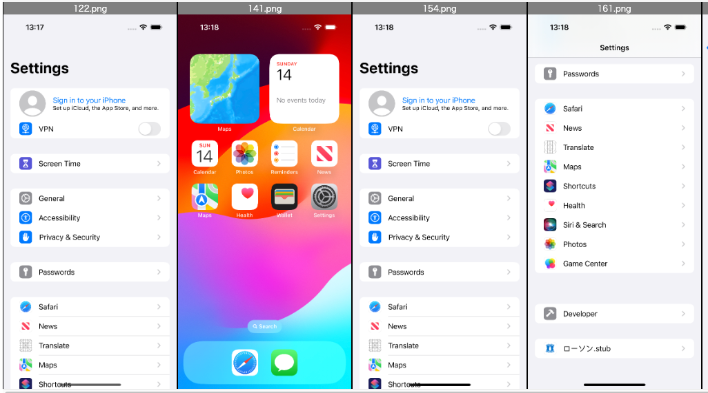

# Quick Start (Shirates/Classic)

## Environment

See [Tested Environments](../environments.md) before installation.

## Installation

Install following prerequisite tools.

**Note:** Do not use OS account with username contains non-ASCII characters or white spaces. Some of following tools
don't work well.


<br>

### IntelliJ IDEA

If you have not installed, download Ultimate or COMMUNITY and install it.
(COMMUNITY is opensource product)

https://www.jetbrains.com/idea/

<br>

### Android Studio

If you have not installed, download Android Studio and install it.

https://developer.android.com/studio

<br>

### Xcode (Mac only)

If you have not installed, search Xcode in App Store and install it.

<br>

### Command Line Tools for Xcode (Mac only)

If you have not installed, open terminal window and run this command.

```
xcode-select --install
```

<br>

### Homebrew (Mac only)

If you have not installed, go to https://brew.sh/ and install it.

<br>

### Java Development Kit (JDK)

If you have not installed, search installation guide and install it.

<br>

### node & npm

If you have not installed, install it.

#### (for Mac)

You can install NPM with brew. Open terminal window and type these.

```
brew install node
node -v
npm -v
```

#### (for Windows)

Download installation package.
https://nodejs.org/en/download/

#### (for Ubuntu)

You can install NPM with apt. Open terminal window and type these.

```
sudo apt update
sudo apt install nodejs
node -v
npm -v
```

<br>

**Note:** Use newer version to avoid troubles of installing appium.

<br>

### Appium 2.0

Appium 2.0 is required.

If you are already using appium, check version.

```
appium -v
```

If you have installed appium 1.x, uninstall it.

```
npm uninstall -g appium
```

Install appium 2.0 using npm.

```
npm install -g appium
appium -v
```

See [Tested Environments](../environments.md) to get tested version.

<br>
If you have already installed appium, uninstall it and install it again.

```
appium -v
npm uninstall -g appium
npm install -g appium
appium -v
```

<br>

### UIAutomator2 driver

Install UIAutomator2 driver.

```
appium driver install uiautomator2
```

<br>
If you have already installed the driver, uninstall it and install it again.

```
appium driver list
appium driver uninstall uiautomator2
appium driver install uiautomator2
appium driver list
```

See [Tested Environments](../environments.md) to get tested version.

<br>

### XCUITest driver(Mac only)

Install XCUITest driver.

```
appium driver install xcuitest
```

<br>
If you have already installed the driver, uninstall it and install it again.

```
appium driver list
appium driver uninstall xcuitest
appium driver install xcuitest
appium driver list
```

See [Tested Environments](../environments.md) to get tested version.

<br>

### Setting Environment Variables (Mac only)

Set environment variables in initializing script (.zshrc or others).

#### Example

```
export ANDROID_SDK_ROOT=/Users/$USER/Library/Android/sdk
export PATH=$ANDROID_SDK_ROOT/emulator:$ANDROID_SDK_ROOT/tools:$ANDROID_SDK_ROOT/platform-tools:$PATH
```

**Note:** Execute log out/log in to take effect above settings.

### Setting Environment Variables (Windows only)

1. Open **Android Studio**.
2. Select `Tools > SDK Manager > Appearance & Behavior > System Settings > Android SDK`
3. Copy Android SDK Location.<br>
   
4. Set environment variable `ANDROID_SDK_ROOT`.<br>
   
5. Edit environment variable `Path`. Add entries as follows.
    - `%ANDROID_SDK_ROOT%\emulator`
    - `%ANDROID_SDK_ROOT%\platform-tools`
    - `%ANDROID_SDK_ROOT%\tools`<br>
      
6. Reboot the PC.

### Setting Environment Variables (Ubuntu only)

Set environment variables in initializing script (.bashrc or others).

#### Example

```
export ANDROID_SDK_ROOT=/home/$USER/Android/Sdk
export PATH=$ANDROID_SDK_ROOT/emulator:$ANDROID_SDK_ROOT/tools:$ANDROID_SDK_ROOT/platform-tools:$PATH
```

## Setting up AVD (Android Virtual Device)

### Create AVD for demo

1. Open **Android Studio**.
2. Select menu `Tools > Device Manager`.
3. Click `[+]`. <br>
   


4. Select `Pixcel 8` and click Next.<br>
   


5. Select `UsideDownCake 34 Android 14.0 (Google Play)` and click `Next` (Google Play Store is required for
   demonstration using **Calculator** app). Select **arm64** image for M1 Mac, otherwise select **x86_64** image.<br>
   

6. Set AVD Name to `Pixel 8(Android 14)`.<br>
   Set `Enable device frame` off.<br>
   Click `Finish`<br>
   

<br>

## Demonstration

Let's see demonstration.

### Opening Project

1. Open **shirates-core** project directory in Finder or Explorer.
2. Right click `build.gradle.kts` and open with IntelliJ IDEA. <br>
   

### Enable right-click test running

1. `IntelliJ IDEA > Settings` (or `File > Settings`)
1. `Build, Execution, Deployment > Build Tools > Gradle`
1. Set `Run tests using` to `IntelliJ IDEA`


<br>

### Run AndroidSettingsDemo

1. Launch the AVD of Android 14 from **Device Manager**.
1. Open `shirates-core` project in IntelliJ, right click on `src/test/Kotlin/demo/AndroidSettingsDemo` and select
   **Debug 'AndroidSettingsDemo'**
1. You'll see logs in the Console like this.

#### Console output

```
Connected to the target VM, address: '127.0.0.1:62387', transport: 'socket'
lineNo	[elapsedTime]	logDateTime	{testCaseId}	macroDepth	macroName	[logType]	timeDiff	mode	(group)	message
1	[00:00:00]	2024/04/14 12:45:59.874	{}	0	-	[-]	+0	C	()	----------------------------------------------------------------------------------------------------
2	[00:00:00]	2024/04/14 12:45:59.890	{}	0	-	[-]	+16	C	()	///
3	[00:00:00]	2024/04/14 12:45:59.891	{}	0	-	[-]	+1	C	()	/// shirates-core 6.8.0
4	[00:00:00]	2024/04/14 12:45:59.891	{}	0	-	[-]	+0	C	()	///
5	[00:00:00]	2024/04/14 12:45:59.892	{}	0	-	[-]	+1	C	()	powered by Appium (io.appium:java-client:9.1.0)
6	[00:00:00]	2024/04/14 12:45:59.892	{}	0	-	[-]	+0	C	()	----------------------------------------------------------------------------------------------------
7	[00:00:00]	2024/04/14 12:45:59.893	{}	0	-	[-]	+1	C	()	testClass: demo.AndroidSettingsDemo
8	[00:00:00]	2024/04/14 12:45:59.893	{}	0	-	[-]	+0	C	()	sheetName: AndroidSettingsDemo
9	[00:00:00]	2024/04/14 12:45:59.893	{}	0	-	[-]	+0	C	()	logLanguage: 
...
```

<br>

### Check output reports

1. Click the hyperlink in the IntelliJ IDEA's console to open the log directory<br>
   
2. You'll see log and report files.<br>
   
3. First, open **_Report(simple).html** file. You'll see simple test report. Click on a line to highlight the screenshot
   image. Double-click on a line to show a larger image.
4. Second, open **_Report(detail).html** file. You'll see more information with log type "info".
5. At last, open **AndroidSettingsDemo@a.xlsx** file with MS-Excel or other compatible software.

### HTML-Report(simple)


### Spec-Report

AndroidSettingsDemo@a.xlsx


### TestList

1. Open Downloads/TestResults in Finder (or Explorer).
1. Open **TestList_androidSettingsConfig.xlsx** file with MS-Excel or other compatible software.

**TestList_androidSettingsConfig.xlsx<br>**


<br>

### Run CalculatorDemo

1. Launch the AVD of Android 14 from **Device Manager**.
2. Open **Google Play Store** and install **Calculator**(Google LLC).
3. Open this project in IntelliJ, right click on `src/test/Kotlin/demo/CalculatorDemo` and select
   **Debug 'CalculatorDemo'**
4. You'll see the calculator test works.



<br>

### Run iOSSettingsDemo

1. Open Xcode and setup iOS Simulator. `iPhone 16(iOS 18.2)`



2. Open shirates-core project in IntelliJ, right click on `src/test/Kotlin/demo/iOSSettingsDemo` and select
   **Debug 'iOSSettingsDemo'**
3. You'll see the iOS Settings test works.



### Link

- [index](index.md)
