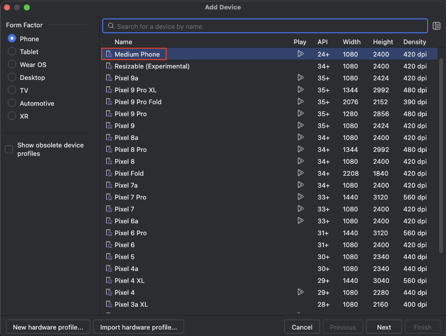

# クイックスタート

## 環境

インストールの前に [Tested Environments](../environments.md) を確認してください。

## インストール

以下の前提となるツールをインストールしてください。

**注意:** ユーザー名に非ASCII文字や空白を含むOSのアカウントを使用しないでください。以下のツールのいくつかは動作しない場合があります。


<br>

### IntelliJ IDEA

インストールしていない場合はUltimate または COMMUNITYをダウンロードしてインストールしてください。
(COMMUNITYはオープンソース製品です)

https://www.jetbrains.com/idea/

<br>

### Android Studio

インストールしていない場合はダウンロードしてインストールしてください。

https://developer.android.com/studio

<br>

### Xcode (Macのみ)

インストールしていない場合はApp StoreでXcodeを検索してインストールしてください。

<br>

### Command Line Tools for Xcode (Macのみ)

インストールしていない場合はターミナルウィンドウを開いて以下のコマンドを実行してください。

```
xcode-select --install
```

<br>

### Homebrew (Macのみ)

インストールしていない場合は https://brew.sh/ を参考にしてインストールしてください。

<br>

### Java Development Kit (JDK)

インストールしていない場合はインストールガイドを検索してインストールしてください。

<br>

### node & npm

インストールしていない場合はインストールしてください。

#### (Macの場合)

NPMをbrewでインストールすることができます。ターミナルウィンドウを開いて以下を実行してください。

```
brew install node
node -v
npm -v
```

#### (Windowsの場合)

インストール用パッケージをダウンロードしてください。
https://nodejs.org/en/download/

#### (Ubuntuの場合)

NPMをaptでインストールすることができます。ターミナルウィンドウを開いて以下を実行してください。

```
sudo apt update
sudo apt install nodejs
node -v
npm -v
```

<br>

**注意:** Appiumのインストールで問題が発生しないようにするため比較的新しいバージョンを使用してください。

<br>

### Appium 2.0

Appium 2.0が必要です。

すでにAppiumを使用している場合はインストールされているバージョンを確認してください。

```
appium -v
```

Appium 1.xがインストールされている場合はアンインストールしてください。

```
npm uninstall -g appium
```

npmでAppium 2.0をインストールしてください。

```
npm install -g appium
appium -v
```

参照 [テスト済みの環境](../environments.md)

<br>
Appiumをすでにインストールしている場合はアンインストールしてから再度インストールしてください。

```
appium -v
npm uninstall -g appium
npm install -g appium
appium -v
```

<br>

### UIAutomator2 driver

UIAutomator2ドライバーをインストールしてください。

```
appium driver install uiautomator2
```

<br>
すでにドライバーをインストールしている場合はアンインストールしてから再度インストールしてください。

```
appium driver list
appium driver uninstall uiautomator2
appium driver install uiautomator2
appium driver list
```

参照 [テスト済みの環境](../environments.md)

<br>

### XCUITest driver(Macのみ)

XCUITestドライバーをインストールしてください。

```
appium driver install xcuitest
```

<br>
すでにドライバーをインストールしている場合はアンインストールしてから再度インストールしてください。

```
appium driver list
appium driver uninstall xcuitest
appium driver install xcuitest
appium driver list
```

参照 [テスト済みの環境](../environments.md)

<br>

### 環境変数の設定 (Macのみ)

初期化スクリプト(.zshrcなど)で環境変数を設定してください。

#### 例

```
export ANDROID_SDK_ROOT=/Users/$USER/Library/Android/sdk
export PATH=$ANDROID_SDK_ROOT/emulator:$ANDROID_SDK_ROOT/tools:$ANDROID_SDK_ROOT/platform-tools:$PATH
```

**注意:** 上記の設定を有効にするためにログアウト/ログインを実行してください。

### 環境変数の設定(Windowsのみ)

1. **Android Studio**を開きます。
2. メニューから`Tools > SDK Manager > Appearance & Behavior > System Settings > Android SDK`を選択します。
3. Android SDK Locationをコピーします。<br>
   
4. 環境変数を設定します。 `ANDROID_SDK_ROOT`.<br>
   
5. `Path`環境変数を編集します。 以下のようにエントリーを追加してください。
    - `%ANDROID_SDK_ROOT%\emulator`
    - `%ANDROID_SDK_ROOT%\platform-tools`
    - `%ANDROID_SDK_ROOT%\tools`<br>
      
6. PCを再起動します。

### 環境変数の設定(Ubuntuのみ)

初期化スクリプト(.bashrcなど)で環境変数を設定してください。

#### 例

```
export ANDROID_SDK_ROOT=/home/$USER/Android/Sdk
export PATH=$ANDROID_SDK_ROOT/emulator:$ANDROID_SDK_ROOT/tools:$ANDROID_SDK_ROOT/platform-tools:$PATH
```

## AVD (Android Virtual Device)の設定

### デモ用のAVDの作成

1. **Android Studio**を開きます。
2. メニューから`Tools > Device Manager`を選択します。
3. `[+]`をクリックします。 <br>
   


4. `Pixcel 8` を選択して `Next` をクリックします。<br>
   


5. `UpsideDownCake 34 Android 14.0 (Google Play)` を選択して`Next`をクリックします。 (**Calculator**アプリをデモで使用するのでGoogle
   Play Storeが必要です)。 M1 Macの場合は**arm64** イメージを、 それ以外の場合は **x86_64** イメージを選択します。<br>
   


6. AVD名を `Pixel 8(Android 14)`に設定します。<br>
   `Enable device frame`のチェックをOFFに設定します。<br>
   `Finish`をクリックします。<br>
   

<br>

## デモンストレーション

デモを実行してみましょう。

### プロジェクトを開く

1. **shirates-core** プロジェクトのディレクトリを Finder または Explorerで開きます。
2. `build.gradle.kts` を右クリックし、IntelliJ IDEAで開きます。 <br>
   

### 右クリックによるテスト実行を有効にする

1. メニューから`IntelliJ IDEA > Settings` (または `File > Settings`)を選択します。
1. `Build, Execution, Deployment > Build Tools > Gradle`を選択します。
1. `Run tests using` を `IntelliJ IDEA`に設定します


<br>

### AndroidSettingsDemoを実行する

1. **Device Manager** から Android 14 の AVD を起動します。
1. `shirates-core` プロジェクトを IntelliJで開き、 `src/test/Kotlin/demo/AndroidSettingsDemo` を右クリックして **Debug '
   AndroidSettingsDemo'** を選択します。
1. コンソールに以下のようなログが出力されます。

#### Console output

```
Connected to the target VM, address: '127.0.0.1:62387', transport: 'socket'
lineNo	[elapsedTime]	logDateTime	{testCaseId}	macroDepth	macroName	[logType]	timeDiff	mode	(group)	message
1	[00:00:00]	2024/04/14 12:45:59.874	{}	0	-	[-]	+0	C	()	----------------------------------------------------------------------------------------------------
2	[00:00:00]	2024/04/14 12:45:59.890	{}	0	-	[-]	+16	C	()	///
3	[00:00:00]	2024/04/14 12:45:59.891	{}	0	-	[-]	+1	C	()	/// shirates-core 6.8.0
4	[00:00:00]	2024/04/14 12:45:59.891	{}	0	-	[-]	+0	C	()	///
5	[00:00:00]	2024/04/14 12:45:59.892	{}	0	-	[-]	+1	C	()	powered by Appium (io.appium:java-client:9.1.0)
6	[00:00:00]	2024/04/14 12:45:59.892	{}	0	-	[-]	+0	C	()	----------------------------------------------------------------------------------------------------
7	[00:00:00]	2024/04/14 12:45:59.893	{}	0	-	[-]	+1	C	()	testClass: demo.AndroidSettingsDemo
8	[00:00:00]	2024/04/14 12:45:59.893	{}	0	-	[-]	+0	C	()	sheetName: AndroidSettingsDemo
9	[00:00:00]	2024/04/14 12:45:59.893	{}	0	-	[-]	+0	C	()	logLanguage: 
...
```

<br>

### 出力されたレポートの確認

1. IntelliJ IDEAのコンソールのハイパーリンクをクリックしてログのディレクトリを開きます。<br>
   
2. ログやレポートのファイルが出力されていることが確認できます。<br>
   
3. 最初に **_Report(simple).html** ファイルを開きます。シンプルなテストレポートを確認することができます。行をクリックするとスクリーンショット画像がハイライト表示されます。
   行をダブりクリックすると大きな画像が表示されます。
4. 次に **_Report(detail).html** ファイルを開きます。ログタイプが"info"である情報が追加されていることがわかります。
5. 最後に **AndroidSettingsDemo@a.xlsx** ファイルをMicrosoft Excel か互換性のあるソフトウェアで開きます。

### HTMLレポート(simple)


### Spec-Report

AndroidSettingsDemo@a.xlsx


### TestList

1. ダウンロード/TestResults フォルダを Finder (または Explorer)で開きます。
1. **TestList_androidSettingsConfig.xlsx** ファイルを Microsoft Excelか互換性のあるソフトウェアで開きます。

**TestList_androidSettingsConfig.xlsx<br>**


<br>

### CalculatorDemoを実行する

1. **Device Manager**でAndroid 14 のAVDを起動します。
2. **Google Playストア** を開いて **電卓(Calculator)**(Google LLC)をインストールします。
3. IntelliJでこのプロジェクトを開き、`src/test/Kotlin/demo/CalculatorDemo`を右クリックして **Debug 'CalculatorDemo'**
   を選択します。
4. 電卓アプリのテストが実行されます。


<br>

### iOSSettingsDemoの実行

1. Xcode を開き、iOSシミュレーター(iPhone 15, iOS 17.2)をセットアップします。


2. shirates-core プロジェクトをIntelliJで開き,`src/test/Kotlin/demo/iOSSettingsDemo` を右クリックして **Debug '
   iOSSettingsDemo'**
   を選択します。
3. iOSの設定アプリのテストが実行されます。


### Link

- [index](index_ja.md)
