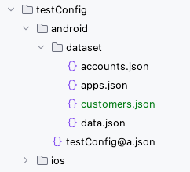
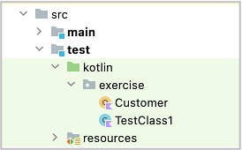

# Creating your own data function

You can create your own data function using `DatasetRepositoryManager`.

## Example

In case you want to create data function for customer.

1. Create a dataset json file `customers.json` under `dataset` directory.



```json
{
  "[customer1]": {
    "name": "customer1",
    "email": "customer1@example.com"
  },
  "[customer2]": {
    "name": "customer2",
    "email": "customer2@example.com"
  }
}
```

2. Add `dataset` section to testConfig.json, bind dataset name `customer` to the dataset json file.

**androidSettingsConfig.json**

```
  "dataset": {
    "customers": "testConfig/android/dataset/customers.json"
  },
```

3. Create a Kotlin Class file for the data function.



4. Implement Customer object class as follows.

```kotlin
package exercise

import shirates.core.configuration.repository.DatasetRepository
import shirates.core.configuration.repository.DatasetRepositoryManager

object Customer {

    /**
     * repository
     */
    var repository: DatasetRepository? = null

    /**
     * getValue
     *
     * key format: [datasetName].attributeName
     */
    fun getValue(key: String): String {

        if (repository == null) {
            repository = DatasetRepositoryManager.getRepository("customers")
        }

        val value = repository!!.getValue(longKey = key)
        return value
    }
}

/**
 * customer
 */
fun customer(key: String): String {

    return Customer.getValue(key = key)
}
```

Now you can use customer data function as follows.

### CustomerTest.kt

```kotlin
package exercise

import org.junit.jupiter.api.Test
import shirates.core.vision.driver.commandextension.output
import shirates.core.vision.testcode.VisionTest

class CustomerTest : VisionTest() {

    @Test
    fun test() {

        scenario {
            case(1) {
                action {
                    output(customer("[customer1].name"))
                    output(customer("[customer1].email"))
                }
            }
        }
    }
}
```

#### Console

```
126	[00:00:21]	2025/01/31 14:10:31.442	{test-1}	0	-	[CASE]	+425	!	()	(1)
127	[00:00:21]	2025/01/31 14:10:31.446	{test-1}	0	-	[ACTION]	+4	!	()	action
128	[00:00:21]	2025/01/31 14:10:31.448	{test-1}	0	-	[output]	+2	!	(output)	customer1
129	[00:00:21]	2025/01/31 14:10:31.449	{test-1}	0	-	[output]	+1	!	(output)	customer1@example.com
```

### Link

- [index(Vision)](../../index.md)
- [index(Classic)](../../classic/index.md)

