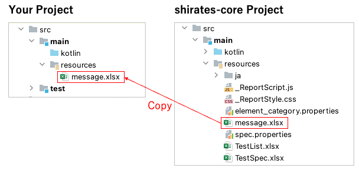
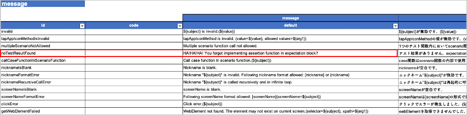

# メッセージをカスタマイズする (Vision/Classic)

リソースファイルを使用してメッセージをカスタマイズすることができます。

1. プロジェクトの`src/test`ディレクトリの下に`resources`ディレクトリを作成します。
2. shirates-coreプロジェクトの`message.xlsx`をコピーして配置します。
   <br> 

3. `messages.xlsx`を任意にカスタマイズします。
   <br> **message.xlsx**
   <br> 

例として、`noTestResultFound`の行のメッセージ（デフォルト）を書き換えてみます。

### Before

```
No test result found. Use assertion function in expectation block.
```

### After

```
HA!HA!HA! You forgot implementing assertion function in expectation block?
```

4. message.xlsxを保存します。
5. プロジェクトをビルドします。
6. テストコードを以下のように実装します。

```kotlin
package exercise

import org.junit.jupiter.api.Test
import shirates.core.configuration.Testrun
import shirates.core.testcode.UITest

@Testrun("testConfig/android/androidSettings/testrun.properties")
class NoTestResultTest : UITest() {

    @Test
    fun test1() {

        scenario {
            case(1) {

            }
        }
    }
}
```

7. テストを実行します。

### 実行結果

```
97	2022/09/28 21:46:40.313	{test1}	[SCENARIO]	(scenario)	test1()
98	2022/09/28 21:46:40.313	{test1-1}	[CASE]	(case)	(1)
99	2022/09/28 21:46:40.314	{test1-1}	[ACTION]	(action)	action
100	2022/09/28 21:46:40.784	{test1-1}	[screenshot]	(screenshot)	screenshot
101	2022/09/28 21:46:40.786	{test1-1}	[warn]	()	HA!HA!HA! You forgot implementing assertion function in expectation block?
```

### Link

- [index(Vision)](../../index_ja.md)
- [index(Classic)](../../classic/index_ja.md)
