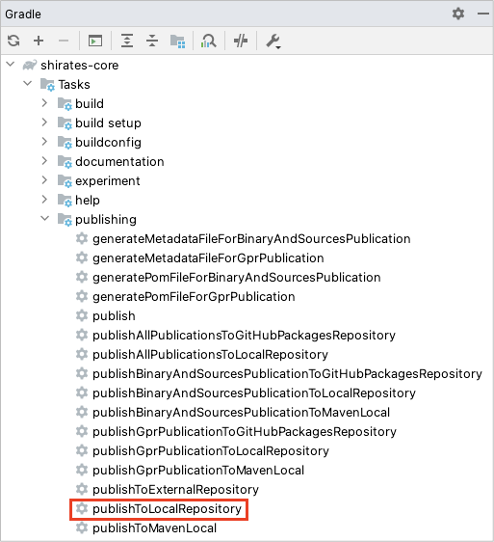
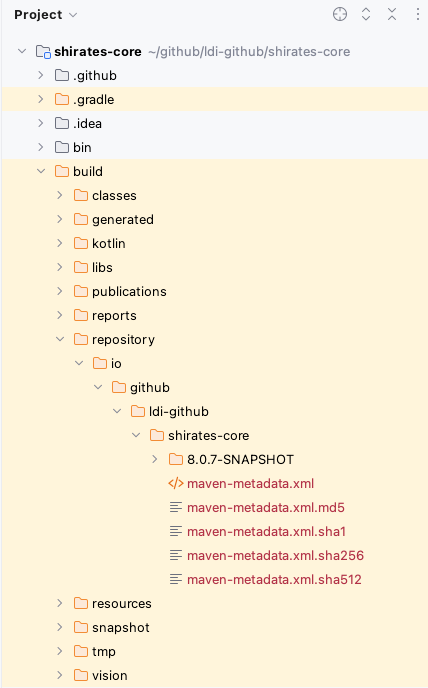

# Local publishing

In some situation you may want to publish shirates-core repository locally. For example you can not access to remote
shirates-core repository, or you are developing and debugging new feature of shirates-core. You can build
shirates-core project and publish locally, and refer to it.

1. Open shirates-core project, double-click `publishToLocalRepository` in Gradle pane.



```
1:58:09: Executing 'publishToLocalRepository'…


> Configure project :
The org.gradle.api.plugins.Convention type has been deprecated. This is scheduled to be removed in Gradle 9.0. Consult the upgrading guide for further information: https://docs.gradle.org/8.12.1/userguide/upgrading_version_8.html#deprecated_access_to_conventions
The org.gradle.api.plugins.JavaPluginConvention type has been deprecated. This is scheduled to be removed in Gradle 9.0. Consult the upgrading guide for further information: https://docs.gradle.org/8.12.1/userguide/upgrading_version_8.html#java_convention_deprecation

> Task :generateBuildConfig UP-TO-DATE
> Task :compileKotlin UP-TO-DATE
> Task :compileJava NO-SOURCE
> Task :processResources
> Task :classes
> Task :jar
> Task :generateMetadataFileForBinaryAndSourcesPublication
> Task :generatePomFileForBinaryAndSourcesPublication
> Task :javadoc NO-SOURCE
> Task :javadocJar UP-TO-DATE
> Task :sourcesJar
> Task :signBinaryAndSourcesPublication
> Task :publishBinaryAndSourcesPublicationToLocalRepository
> Task :generateMetadataFileForGprPublication
> Task :generatePomFileForGprPublication
> Task :publishGprPublicationToLocalRepository SKIPPED
> Task :publishToLocalRepository

[Incubating] Problems report is available at: file:///Users/wave1008/github/ldi-github/shirates-core/build/reports/problems/problems-report.html

BUILD SUCCESSFUL in 7s
12 actionable tasks: 9 executed, 3 up-to-date
1:58:17: Execution finished 'publishToLocalRepository'.
```

2. Confirm that `build/repository` has created.



3. Open your project, refer to build/repository in shirates-core project.

Given that shirates-core project is cloned under `$userHome/github`.

```kotlin
val userHome = System.getProperty("user.home")

repositories {
    mavenCentral()

    maven(url = "file:/$userHome/github/shirates-core/build/repository")
}
```

4. Click reload in Gradle pane.

### Link

- [index(Vision)](../../index.md)
- [index(Classic)](../../classic/index.md)


