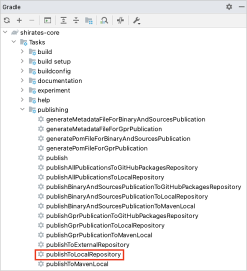

# ローカルへパブリッシュする

何らかの状況下ではshirates-coreのリポジトリをローカルにパブリッシュしたい場合があるかもしれません。
例えばリモートのshirates-coreリポジトリにアクセスできない場合や、shirates-coreの新機能を開発する場合なのです。
shirates-coreプロジェクトをビルドしてローカルにパブリッシュすることでそれを参照できるようになります。

1. shirates-coreプロジェクトを開き、Gradleペインの`publishToLocalRepository`をダブルクリックします。



```
1:20:48: Executing 'publishToLocalRepository'...

> Task :generateBuildConfig UP-TO-DATE
> Task :compileKotlin UP-TO-DATE
> Task :compileJava NO-SOURCE
> Task :processResources UP-TO-DATE
> Task :classes UP-TO-DATE
> Task :inspectClassesForKotlinIC UP-TO-DATE
> Task :jar UP-TO-DATE
> Task :generateMetadataFileForBinaryAndSourcesPublication
> Task :generatePomFileForBinaryAndSourcesPublication

> Task :sourcesJar
Execution optimizations have been disabled for task ':sourcesJar' to ensure correctness due to the following reasons:
  - Gradle detected a problem with the following location: '/Users/wave1008/github/ldi-github/shirates-core/build/generated/source/buildConfig/main/main'. Reason: Task ':sourcesJar' uses this output of task ':generateBuildConfig' without declaring an explicit or implicit dependency. This can lead to incorrect results being produced, depending on what order the tasks are executed. Please refer to https://docs.gradle.org/7.4.2/userguide/validation_problems.html#implicit_dependency for more details about this problem.

> Task :publishBinaryAndSourcesPublicationToLocalRepository
> Task :generateMetadataFileForGprPublication
> Task :generatePomFileForGprPublication
> Task :publishGprPublicationToLocalRepository SKIPPED
> Task :publishToLocalRepository

Deprecated Gradle features were used in this build, making it incompatible with Gradle 8.0.

You can use '--warning-mode all' to show the individual deprecation warnings and determine if they come from your own scripts or plugins.

See https://docs.gradle.org/7.4.2/userguide/command_line_interface.html#sec:command_line_warnings

Execution optimizations have been disabled for 1 invalid unit(s) of work during this build to ensure correctness.
Please consult deprecation warnings for more details.

BUILD SUCCESSFUL in 163ms
11 actionable tasks: 6 executed, 5 up-to-date
1:20:48: Execution finished 'publishToLocalRepository'.
```

2. `build/repository`が作成されたことを確認します。


3. 自分のプロジェクトを開き、shirates-coreプロジェクトの`build/repository`を参照します。

shirates-coreプロジェクトが`$userHome/github`の下にクローンされたとすると以下のように記述します。

```kotlin
val userHome = System.getProperty("user.home")

repositories {
    mavenCentral()

    maven(url = "file:/$userHome/github/shirates-core/build/repository")
}
```

4. Gradleペインの`Reload`をクリックします。

### Link

- [index(vision)](../../index_ja.md)
- [index(classic)](../../classic/index_ja.md)

