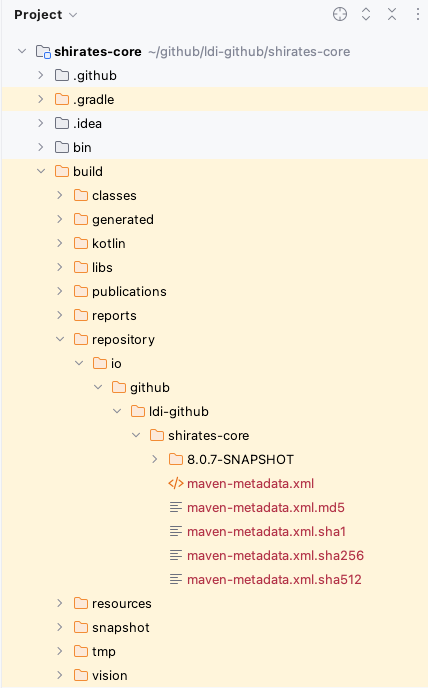

# ローカルへパブリッシュする

何らかの状況下ではshirates-coreのリポジトリをローカルにパブリッシュしたい場合があるかもしれません。
例えばリモートのshirates-coreリポジトリにアクセスできない場合や、shirates-coreの新機能を開発する場合です。
shirates-coreプロジェクトをビルドしてローカルにパブリッシュすることでそれを参照できるようになります。

1. shirates-coreプロジェクトを開き、Gradleペインの`publishToLocalRepository`をダブルクリックします。


```
1:58:09: Executing 'publishToLocalRepository'…


> Configure project :
The org.gradle.api.plugins.Convention type has been deprecated. This is scheduled to be removed in Gradle 9.0. Consult the upgrading guide for further information: https://docs.gradle.org/8.12.1/userguide/upgrading_version_8.html#deprecated_access_to_conventions
The org.gradle.api.plugins.JavaPluginConvention type has been deprecated. This is scheduled to be removed in Gradle 9.0. Consult the upgrading guide for further information: https://docs.gradle.org/8.12.1/userguide/upgrading_version_8.html#java_convention_deprecation

> Task :generateBuildConfig UP-TO-DATE
> Task :compileKotlin UP-TO-DATE
> Task :compileJava NO-SOURCE
> Task :processResources
> Task :classes
> Task :jar
> Task :generateMetadataFileForBinaryAndSourcesPublication
> Task :generatePomFileForBinaryAndSourcesPublication
> Task :javadoc NO-SOURCE
> Task :javadocJar UP-TO-DATE
> Task :sourcesJar
> Task :signBinaryAndSourcesPublication
> Task :publishBinaryAndSourcesPublicationToLocalRepository
> Task :generateMetadataFileForGprPublication
> Task :generatePomFileForGprPublication
> Task :publishGprPublicationToLocalRepository SKIPPED
> Task :publishToLocalRepository

[Incubating] Problems report is available at: file:///Users/wave1008/github/ldi-github/shirates-core/build/reports/problems/problems-report.html

BUILD SUCCESSFUL in 7s
12 actionable tasks: 9 executed, 3 up-to-date
1:58:17: Execution finished 'publishToLocalRepository'.
```

2. `build/repository`が作成されたことを確認します。



3. 自分のプロジェクトを開き、shirates-coreプロジェクトの`build/repository`を参照します。

shirates-coreプロジェクトが`$userHome/github`の下にクローンされたとすると以下のように記述します。

```kotlin
val userHome = System.getProperty("user.home")

repositories {
    mavenCentral()

    maven(url = "file:/$userHome/github/shirates-core/build/repository")
}
```

4. Gradleペインの`Reload`をクリックします。

### Link

- [index(Vision)](../../index_ja.md)
- [index(Classic)](../../classic/index_ja.md)

