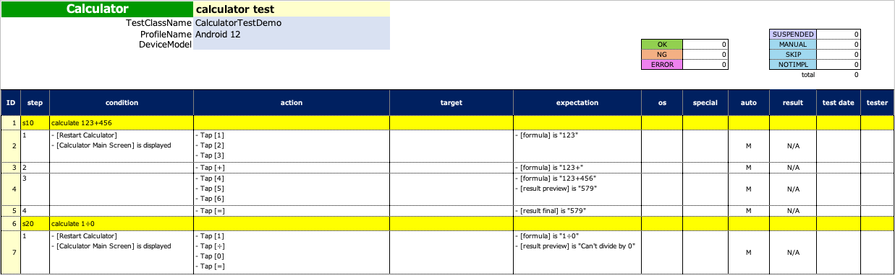
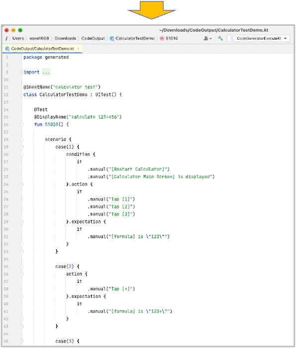
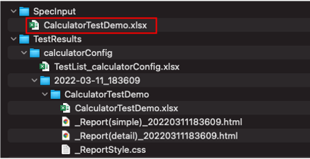
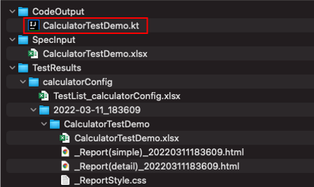

# CodeGeneratorExecute (Vision/Classic)

Spec-Reportの書式から **テストコードのテンプレート** を生成することができます。





## 関数を作成する

1. `CodeGeneratorExecute`という名前でクラスを作成します。
2. main関数を以下のように作成します。

```kotlin
import shirates.spec.code.model.CodeGenerationExecutor

fun main() {

    CodeGenerationExecutor().execute()
}
```

## 関数を実行する

1. ダウンロードディレクトリの下に`SpecInput`ディレクトリを作成します。
2. Spec-Reportの書式で記述した **テスト仕様書ファイル** を`SpecInput`ディレクトリに配置します。<br>
   
3. `CodeGeneratorExecute.kt`を右クリックして`run`を選択します。
4. `CodeOutput`ディレクトリにテストコードのテンプレートが生成されます。<br>
   

### CalculatorTestDemo.kt (生成されたファイル)

```kotlin
package generated

import org.junit.jupiter.api.DisplayName
import org.junit.jupiter.api.Test
import shirates.core.configuration.Testrun
import shirates.core.driver.branchextension.*
import shirates.core.driver.commandextension.*
import shirates.core.driver.function.*
import shirates.core.testcode.*

@SheetName("calculator test")
class CalculatorDemo : UITest() {

    @Manual
    @Test
    @DisplayName("calculate 123+456")
    fun S1010() {

        scenario {
            case(1) {
                condition {
                    it.macro("[Restart Calculator]")
                        .screenIs("[Calculator Main Screen]")
                }.action {
                    it.tap("[1]")
                        .tap("[2]")
                        .tap("[3]")
                }.expectation {
                    it.select("[formula]").textIs("123")
                }
            }
            case(2) {
                action {
                    it.tap("[+]")
                }.expectation {
                    it.select("[formula]").textIs("123+")
                }
            }
            case(3) {
                action {
                    it.tap("[4]")
                        .tap("[5]")
                        .tap("[6]")
                }.expectation {
                    it.select("[formula]").textIs("123+456")
                        .select("[result preview]").textIs("579")
                }
            }
            case(4) {
                action {
                    it.tap("[=]")
                }.expectation {
                    it.select("[result final]").textIs("579")
                }
            }
        }
    }

    @Manual
    @Test
    @DisplayName("calculate 1÷0")
    fun S1020() {

        scenario {
            case(1) {
                condition {
                    it.macro("[Restart Calculator]")
                        .screenIs("[Calculator Main Screen]")
                }.action {
                    it.tap("[1]")
                        .tap("[÷]")
                        .tap("[0]")
                        .tap("[=]")
                }.expectation {
                    it.select("[formula]").textIs("1÷0")
                        .select("[result preview]").textIs("Can't divide by 0")
                }
            }
        }
    }

}
```

### Link

- [index(Vision)](../../index_ja.md)
- [index(Classic)](../../classic/index_ja.md)

