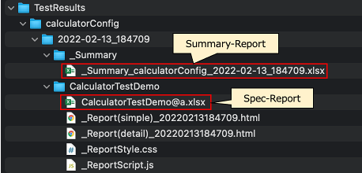

# SummaryReportExecute (Vision/Classic)

**Summary-Report** を作成する関数を作成することができます。

## 関数を作成する

1. `SummaryReportExecute`という名前でクラスを作成します。
2. main関数を以下のように作成します。

```kotlin
import shirates.spec.report.models.SummaryReportExecutor

fun main() {

    SummaryReportExecutor().execute()
}
```

## 関数を実行する

1. テストを実行して**Spec-Report** を作成します。
2. `SummaryReportExecute.kt`を右クリックして`run`を選択します。
3. **Summary-Report**が作成されます。



## Summary-Report


### Link

- [index(Vision)](../../index_ja.md)
- [index(Classic)](../../classic/index_ja.md)
