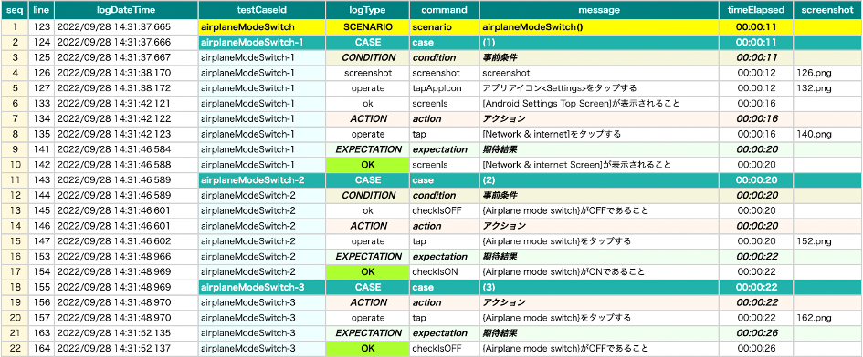

# Log language (Vision/Classic)

You can change language for logging and reporting using **logLanguage** parameter.

### Note

- This is not language setting parameter for Android/iOS devices. You should use Appium's capability setting instead.
  See [Device language](device_language.md)

### Supported language

| logLanguage | Language |
|:------------|----------|
| ""(empty)   | English  |
| ja          | Japanese |

## Sample code

[Getting samples](../../getting_samples.md)

### AndroidSettingsDemo.kt

(`kotlin/demo/AndroidSettingsDemo.kt`)

```kotlin
package demo

import org.junit.jupiter.api.Test
import shirates.core.configuration.Testrun
import shirates.core.driver.commandextension.*
import shirates.core.testcode.UITest

@Testrun("testConfig/android/androidSettings/testrun.properties")
class AndroidSettingsDemo : UITest() {

    @Test
    fun airplaneModeSwitch() {

        scenario {
            case(1) {
                condition {
                    it.launchApp("Settings")
                        .screenIs("[Android Settings Top Screen]")
                }.action {
                    it.tap("[Network & internet]")
                }.expectation {
                    it.screenIs("[Network & internet Screen]")
                }
            }

            case(2) {
                condition {
                    it.select("{Airplane mode switch}")
                        .checkIsOFF()
                }.action {
                    it.tap("{Airplane mode switch}")
                }.expectation {
                    it.select("{Airplane mode switch}")
                        .checkIsON()
                }
            }

            case(3) {
                action {
                    it.tap("{Airplane mode switch}")
                }.expectation {
                    it.select("{Airplane mode switch}")
                        .checkIsOFF()
                }
            }
        }
    }
}
```

### testrun.properties (default)

```
#logLanguage=
```

### Result (default)


### testrun.properties (ja)

```
logLanguage=ja
```

### Result (ja)



### Link

- [index(Vision)](../../index.md)
- [index(Classic)](../../classic/index.md)


