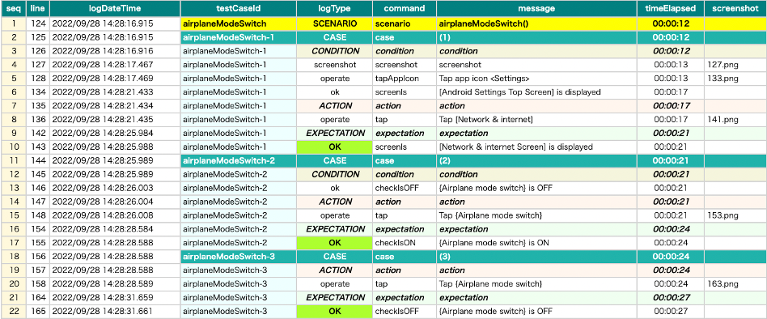

# ログ出力の言語 (Vision/Classic)

**logLanguage** を設定するとログ出力とレポートの言語を変更できます。

### 注意

- これはAndroid/iOSデバイスの言語設定パラメーターではありません。代わりにAppiumのcapabilityを設定する必要があります。
  参照 [デバイスの言語](device_language_ja.md)

### サポートする言語

| logLanguage | 言語      |
|:------------|---------|
| ""(empty)   | English |
| ja          | 日本語     |

## 例

### AndroidSettingsDemo.kt

(`kotlin/demo/AndroidSettingsDemo.kt`)

```kotlin
package demo

import org.junit.jupiter.api.Test
import shirates.core.configuration.Testrun
import shirates.core.driver.commandextension.*
import shirates.core.testcode.UITest

@Testrun("testConfig/android/androidSettings/testrun.properties")
class AndroidSettingsDemo : UITest() {

    @Test
    fun airplaneModeSwitch() {

        scenario {
            case(1) {
                condition {
                    it.launchApp("Settings")
                        .screenIs("[Android Settings Top Screen]")
                }.action {
                    it.tap("[Network & internet]")
                }.expectation {
                    it.screenIs("[Network & internet Screen]")
                }
            }

            case(2) {
                condition {
                    it.select("{Airplane mode switch}")
                        .checkIsOFF()
                }.action {
                    it.tap("{Airplane mode switch}")
                }.expectation {
                    it.select("{Airplane mode switch}")
                        .checkIsON()
                }
            }

            case(3) {
                action {
                    it.tap("{Airplane mode switch}")
                }.expectation {
                    it.select("{Airplane mode switch}")
                        .checkIsOFF()
                }
            }
        }
    }
}
```

### testrun.properties (default)

```
#logLanguage=
```

### 実行結果 (default)



### testrun.properties (ja)

```
logLanguage=ja
```

### 実行結果 (ja)


### Link

- [index(Vision)](../../index_ja.md)
- [index(Classic)](../../classic/index_ja.md)

