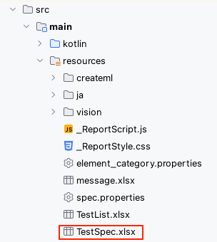
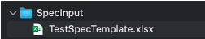
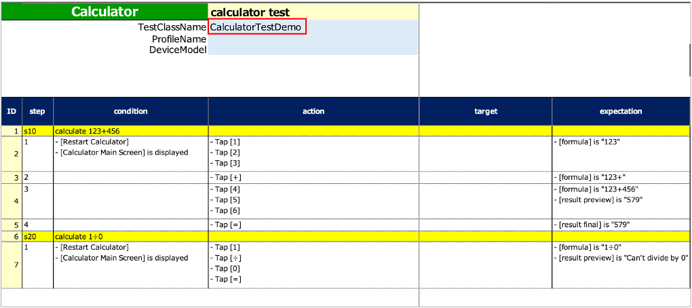

# テストコードのテンプレートを生成する (Vision/Classic)

既存の手動テスト仕様書をShiratesのテストコードに移行することができます。

テンプレートコードの生成と利用はタイピング量を減らすことができます。

1. `SpecInput` ディレクトリをダウンロードディレクトリの下に作成します。

2. shirates-coreプロジェクトの `src/main/resources/TestSpec.xlsx` を `SpecInput`にコピーし、任意の名前に変更します。





3. TestClassNameを入力します。

4. 既存の手動テストをSpec-Reportの書式に移行します。

   

5. `CodeGeneratorExecute.kt` を作成し、以下のように実装します。

### CodeGeneratorExecute.kt

```kotlin
import shirates.spec.code.model.CodeGenerationExecutor

fun main() {

    CodeGenerationExecutor().execute()
}
```

6. `CodeGeneratorExecute.kt`を右クリックして`Run`を選択します。

7. `ダウンロード/CodeOutput`ディレクトに生成されたファイルを開きます。

### 出力されたテンプレートコード

```kotlin
package generated

import org.junit.jupiter.api.DisplayName
import org.junit.jupiter.api.Test
import shirates.core.driver.commandextension.*
import shirates.core.testcode.NoLoadRun
import shirates.core.testcode.SheetName
import shirates.core.testcode.UITest

@SheetName("calculator test")
class CalculatorTestDemo : UITest() {

    @Manual
    @Test
    @DisplayName("calculate 123+456")
    fun S1010() {

        scenario {
            case(1) {
                condition {
                    it.macro("[Restart Calculator]")
                        .screenIs("[Calculator Main Screen]")
                }.action {
                    it.tap("[1]")
                        .tap("[2]")
                        .tap("[3]")
                }.expectation {
                    it.select("[formula]").textIs("123")
                }
            }
            case(2) {
                action {
                    it.tap("[+]")
                }.expectation {
                    it.select("[formula]").textIs("123+")
                }
            }
            case(3) {
                action {
                    it.tap("[4]")
                        .tap("[5]")
                        .tap("[6]")
                }.expectation {
                    it.select("[formula]").textIs("123+456")
                        .select("[result preview]").textIs("579")
                }
            }
            case(4) {
                action {
                    it.tap("[=]")
                }.expectation {
                    it.select("[result final]").textIs("579")
                }
            }
        }
    }

    @Manual
    @Test
    @DisplayName("calculate 1÷0")
    fun S1020() {

        scenario {
            case(1) {
                condition {
                    it.macro("[Restart Calculator]")
                        .screenIs("[Calculator Main Screen]")
                }.action {
                    it.tap("[1]")
                        .tap("[÷]")
                        .tap("[0]")
                        .tap("[=]")
                }.expectation {
                    it.select("[formula]").textIs("1÷0")
                        .select("[result preview]").textIs("Can't divide by 0")
                }
            }
        }
    }

}
```

実際に動作するようにテストを実装する必要があります。

### 実装したテストコードの例

```kotlin
package generated

import org.junit.jupiter.api.DisplayName
import org.junit.jupiter.api.Test
import shirates.core.configuration.Testrun
import shirates.core.driver.commandextension.*
import shirates.core.testcode.SheetName
import shirates.core.testcode.UITest

@Testrun("testConfig/android/calculator/testrun.properties")
@SheetName("calculator test")
class CalculatorTestDemo : UITest() {

    @Test
    @DisplayName("calculate 123+456")
    fun S1010() {

        scenario {
            case(1) {
                condition {
                    it.macro("[Restart Calculator]")
                        .screenIs("[Calculator Main Screen]")
                }.action {
                    it.tap("[1]")
                        .tap("[2]")
                        .tap("[3]")
                }.expectation {
                    it.select("[formula]").textIs("123")
                }
            }
            case(2) {
                action {
                    it.tap("[+]")
                }.expectation {
                    it.select("[formula]").textIs("123+")
                }
            }
            case(3) {
                action {
                    it.tap("[4]")
                        .tap("[5]")
                        .tap("[6]")
                }.expectation {
                    it.select("[formula]").textIs("123+456")
                        .select("[result preview]").textIs("579")
                }
            }
            case(4) {
                action {
                    it.tap("[=]")
                }.expectation {
                    it.select("[result final]").textIs("579")
                }
            }
        }
    }

    @Test
    @DisplayName("calculate 1÷0")
    fun S1020() {

        scenario {
            case(1) {
                condition {
                    it.macro("[Restart Calculator]")
                        .screenIs("[Calculator Main Screen]")
                }.action {
                    it.tap("[1]")
                        .tap("[÷]")
                        .tap("[0]")
                        .tap("[=]")
                }.expectation {
                    it.select("[formula]").textIs("1÷0")
                        .select("[result preview]").textIs("Can't divide by 0")
                }
            }
        }
    }

}
```

### Link

- [index](../../index_ja.md)
