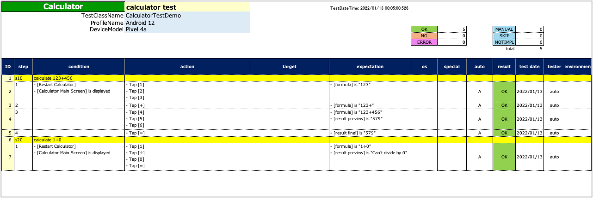
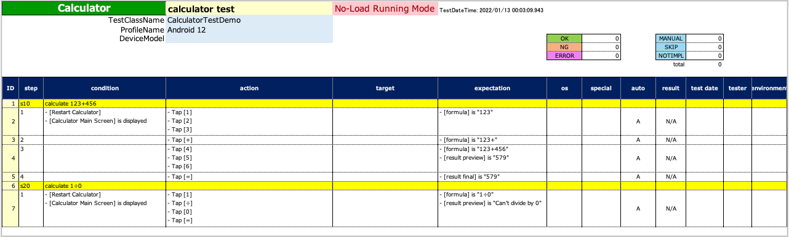

# 無負荷実行モード (NLRモード)

**無負荷実行モード**を使用すると手動テストで利用できる[Spec-Report](../report/spec_report_ja.md)が出力されます。

このモードでは実際のテストを実行することなく全てのコマンドがログを出力します。
全ての条件分岐（ifTrue, ifFalse, android, ios, specialTagなど）はテスト対象のシステムと対話することなく内部のコマンドを実行してログを出力します。

## 無負荷実行モードでテストを実行する

1. [testrunファイル](../parameter/parameter_configuration_files_ja.md)で`noLoadRun`をtrueに設定します。

```
noLoadRun=true
```

2. テストを実行します。
3. TestResultsディレクトリにSpec-Reportが出力されます。

<br>

### 比較

#### 通常モード

`noLoadRun=false`



#### 無負荷実行モード

`noLoadRun=true`



### Link

- [index(Vision)](../../index.md)
- [index(Classic)](../../classic/index.md)
