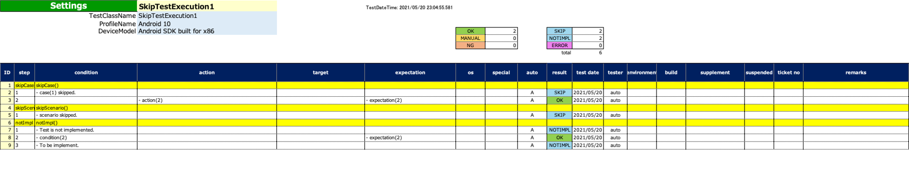

# Spec-Report

Test results in **Spec-Report** format is output into TestResults folder after test execution finished.

 

### Link

- [index(Vision)](../../index.md)
- [index(Classic)](../../classic/index.md)
