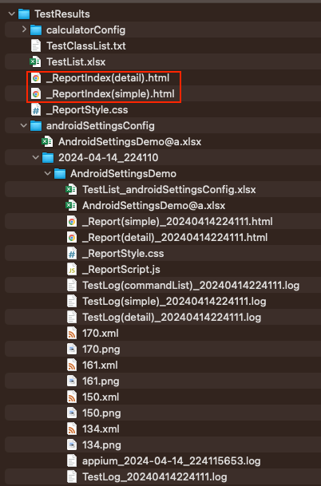

# Test Report Index

**Test Report Index** は[HTMLレポート](../creating_testclass/test_result_files_ja.md)のインデックスです。

テスト結果のサマリーをほぼリアルタイム（ポーリング）で確認できます。

### Link

- [index(vision)](../../index.md)
- [index(classic)](../../classic/index.md)
