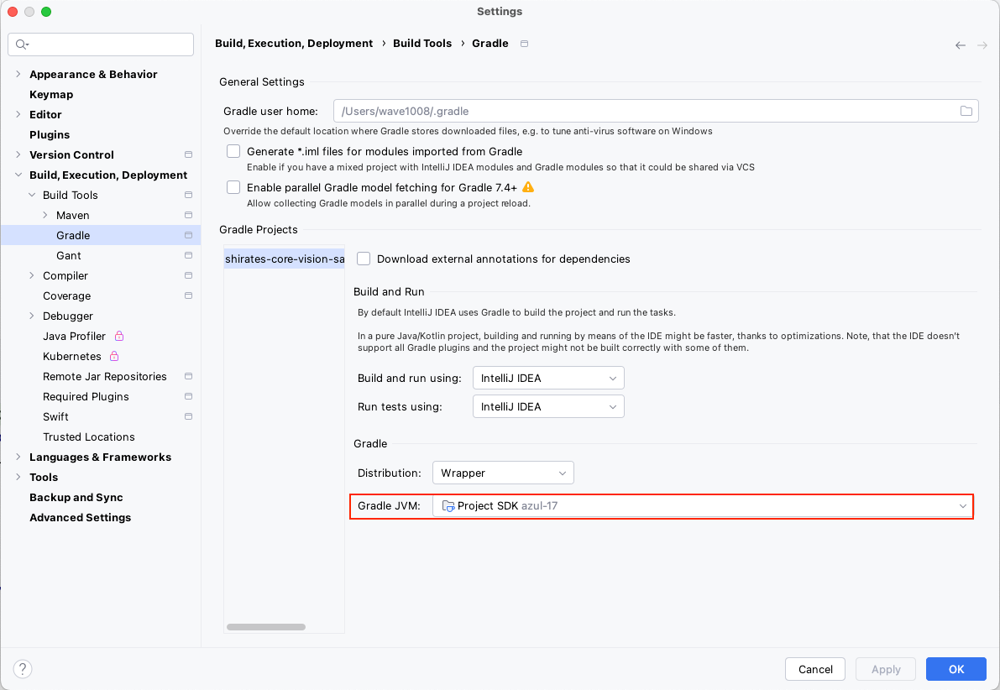
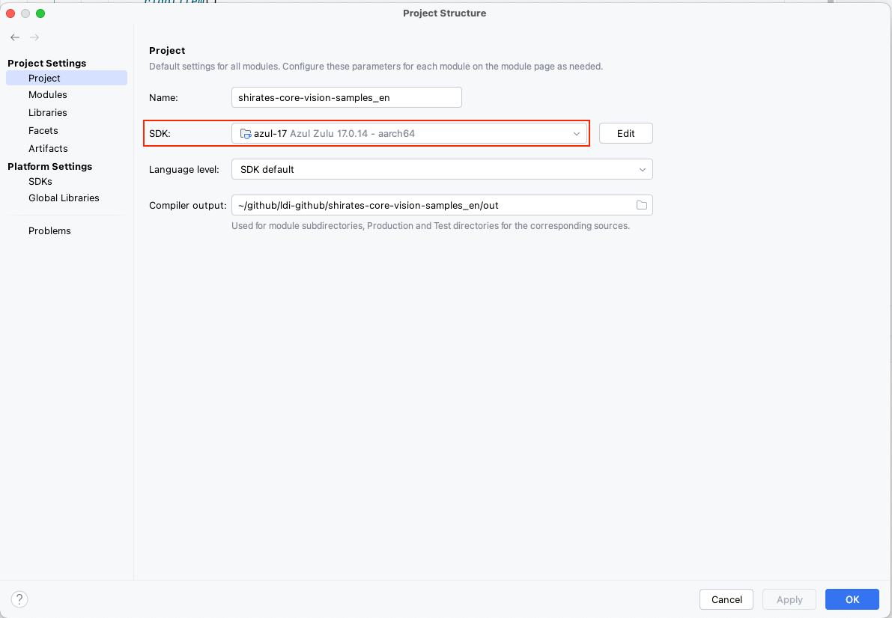

# JVMのバージョン, JDKのバージョン (Vision/Classic)

## IntelliJ IDEA

### IntelliJ IDEA > Settings > Build,Execution,Deployment > Build Tools > Gradle

### File > Project Structure > Project

### Link

- [index(Vision)](../../index_ja.md)
- [index(Classic)](../../classic/index_ja.md)

