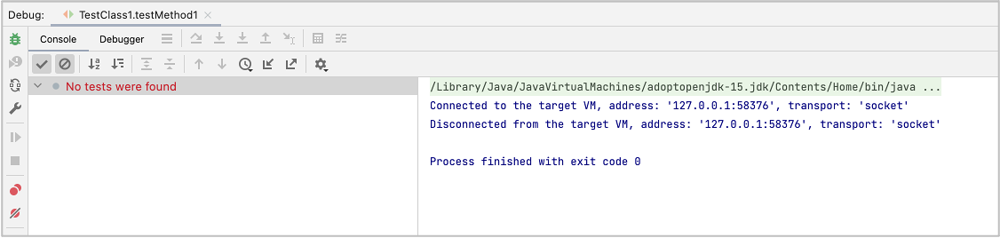
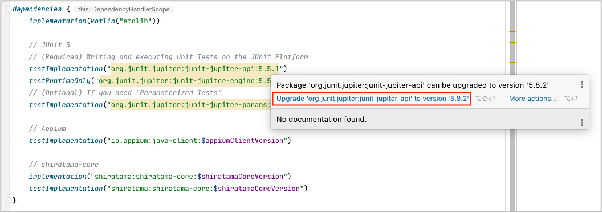

# No tests were found

## Symptom

No tests were found. You can not start any test.

## Cause

JUnit 5 version specified is too old.

## Solution

Try update JUnit 5 dependencies in build.gradle.

Do not forget to reload in Gradle pane.

### Link

- [Troubleshooting](../troubleshooting.md)
