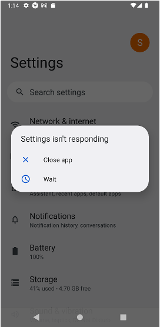

# App isn't responding

## Symptom

You got App isn't responding dialog.

## Platform

Android

## Solution

a) Reboot emulator.

b) AVD property `Graphics` in `Emulated Performance` section may resolve your problem.
See https://developer.android.com/studio/run/managing-avds#avdproperties

### Link

- [Troubleshooting](../troubleshooting.md)
