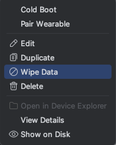

# Wipe Data on Android emulator

Android emulator become unstable after using for a while. 
Try reset data as follows.

## Wipe Data

1. Open Device Manager in Android Studio.
2. Select the AVD.
3. Select `Wipe Data` on the menu. All apps that you installed and user data will be cleared. 
   

### Link

- [Troubleshooting](../troubleshooting.md)
