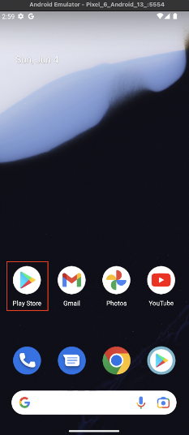

# Enabling Google Play Store

You can set **Google Play Store** enabled as follows.

1. Open finder and go to `/Users/username/.android/avd/avdname`.
   <br>
2. Open `config.ini` with text editor.
3. Set `PlayStore.enabled = true`.
4. Replace `google_apis` with `google_apis_playstore`.
5. Save file.
6. `Cold Boot Now`.
   <br>
7. You can see **Play Store** icon.
   <br>

### After edit (example)

```
AvdId = Pixel_6_Android_13_
PlayStore.enabled = true
abi.type = arm64-v8a
avd.ini.displayname = Pixel 6(Android 13)
avd.ini.encoding = UTF-8
disk.dataPartition.size = 6442450944
fastboot.chosenSnapshotFile = 
fastboot.forceChosenSnapshotBoot = no
fastboot.forceColdBoot = no
fastboot.forceFastBoot = yes
hw.accelerometer = yes
hw.arc = false
hw.audioInput = yes
hw.battery = yes
hw.camera.back = virtualscene
hw.camera.front = emulated
hw.cpu.arch = arm64
hw.cpu.ncore = 4
hw.dPad = no
hw.device.hash2 = MD5:3db3250dab5d0d93b29353040181c7e9
hw.device.manufacturer = Google
hw.device.name = pixel_6
hw.gps = yes
hw.gpu.enabled = yes
hw.gpu.mode = auto
hw.initialOrientation = Portrait
hw.keyboard = yes
hw.lcd.density = 420
hw.lcd.height = 2400
hw.lcd.width = 1080
hw.mainKeys = no
hw.ramSize = 1536
hw.sdCard = yes
hw.sensors.orientation = yes
hw.sensors.proximity = yes
hw.trackBall = no
image.sysdir.1 = system-images/android-33/google_apis_playstore/arm64-v8a/
runtime.network.latency = none
runtime.network.speed = full
sdcard.size = 512M
showDeviceFrame = no
skin.dynamic = yes
skin.name = 1080x2400
skin.path = _no_skin
skin.path.backup = /Users/wave1008/Library/Android/sdk/skins/pixel_6
tag.display = Google APIs
tag.id = google_apis
vm.heapSize = 228
```

### Link

- [index(Vision)](../../index.md)
- [index(Classic)](../../classic/index.md)
