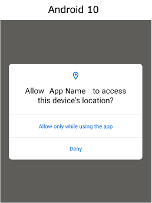
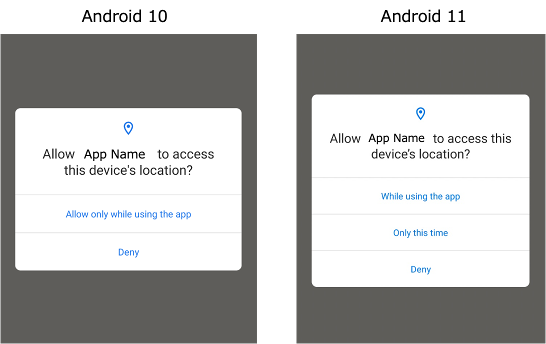

# Adapting to changes in OS messages

After upgrading to a new version of OS, the test code that always succeeds may fail.

Changes in messages may the cause of this issue.

## Example

The following is **Location Permissions** dialog for Android 10.



You can tap **"Allow only while using the app"** using `tap` function.

```kotlin
@Test
@Order(10)
fun original() {

    scenario {
        case(1) {
            action {
                it.tap("Allow only while using the app")
            }
        }
    }
}
```

When upgrading from Android 10 to 11, **"Allow only while using the app"** changes to **"While using the app"**.



The test code fails.

In this case, you might adapt your test code using conditional `if-else` branch.

### Using conditional branch

```kotlin
if (platformVersion.toInt() < 11) {
    it.tap("Allow only while using the app")
} else {
    it.tap("While using the app")
}
```

This works, but is not a good idea.

Instead of using conditional branch, you can use selector "||"(or).

### Using `||` in selector

```kotlin
it.tap("Allow only while using the app||While using the app")
```

This is better than former, but writing literals in test code makes it less maintainable.

It's better to use nickname.

### Using nickname

```kotlin
it.tap("[While using the app]")
```

Define nickname in screen nickname file

```
"[While using the app]": "Allow only while using the app||While using the app"
```

### Link

- [index](../../index.md)

