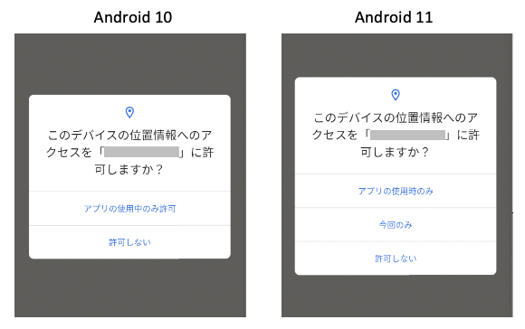

# OSのメッセージの変更に対応する

OSを新しいバージョンにアップグレードすると、以前は常に成功していたテストコードが失敗するようになるがあります。

OSのメッセージの変更がこの原因である可能性があります。

## 例

### AdaptingToChangesInMessage1_ja.kt

(`kotlin/tutorial/inaction/AdaptingToChangesInMessage1_ja.kt`)

<br>

以下はAndroid 10における**位置情報アクセス許可**ダイアログです。


`tap`関数を使用して **"アプリの使用中のみ許可"** をタップすることができます。

```kotlin
it.tap("アプリの使用中のみ許可")
```

Android 10 から 11へアップグレードした場合は **"アプリの使用中のみ許可"** は **"アプリの使用時のみ"** に変更されます。



テストコードは失敗します。

この場合、テストコードを修正して`if-else`で分岐処理する必要があります。

### 条件分岐の使用

```kotlin
if (platformMajorVersion < 11) {
    it.tap("アプリの使用中のみ許可")
} else {
    it.tap("アプリの使用時のみ")
}
```

これは動作しますが良い方法ではありません。

条件分岐を使用する代わりにセレクター内で `||`(or)を使用することができます。

### セレクター内で `||` を使用する

```kotlin
it.tap("アプリの使用中のみ許可||アプリの使用時のみ")
```

これはベターな方法ですが、テストコード内に複数のメッセージを記述するのはメンテナンス性がよくありません。

### ニックネームを使用する

ニックネームを使用するとメンテナンス性の問題が改善します。

```kotlin
it.tap("[アプリの使用時のみ]")
```

ニックネームは画面ニックネームファイル内に定義します。

```
"[アプリの使用時のみ]": "アプリの使用中のみ許可||アプリの使用時のみ"
```

### Link

- [index](../../index_ja.md)

