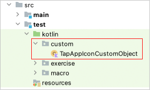

# Tapping app icon to launch

## tapAppIcon function

You can tap app icon to launch app with [tapAppIcon](../../basic/function_property/tap_element/tap_app_icon.md)
function.

```kotlin
it.tapAppIcon("Chrome")
```

This function is optimized for `Google Pixel` and `iOS` by default.

## Configuring parameters

On android devices, hardware manufacturer may install their own graphical user interface(GUI) for home screen and app
launcher. You can specify how to tap app icon in profiles with parameter **tapAppIconMethod** or **tapAppIconMacro**.

See [parameters](../../basic/parameter/parameters.md).

### tapAppIconMethod

| value           | description                                          |
|:----------------|:-----------------------------------------------------|
| auto            | Default. In Android, currently same as `googlePixel` |
| googlePixel     | Optimized for Google Pixel                           |
| swipeLeftInHome | Find app icon with swiping home screen to left       |

### tapAppIconMacro

Specify macro name that you created.

## Example

### profiles

```
  "profiles": [
    {
      "profileName": "Android/googlePixel",
      "tapAppIconMethod": "googlePixel",
      "capabilities": {
      }
    },
    {
      "profileName": "Android/swipeLeftInHome",
      "tapAppIconMethod": "swipeLeftInHome",
      "capabilities": {
      }
    },
    {
      "profileName": "Android/TapAppIconMacro1",
      "tapAppIconMacro": "[TapAppIconMacro1]",
      "capabilities": {
      }
    }
  ]
```

### TapAppIconMacro.kt

(`kotlin/macro/common/TapAppIconMacro.kt`)

```kotlin
@MacroObject
object TapAppIconMacro : TestDrive {

    @Macro("[TapAppIconMacro1]")
    fun tapAppIconMacro1(appIconName: String) {

        android {
            it.pressHome()
            it.flickBottomToTop()

            if (it.canSelectWithScrollDown(appIconName)) {
                it.tap()
                    .wait()
            }
        }
        ios {
            it.tapAppIcon(appIconName)
        }
    }
}
```

You can use `[TapAppIconMacro1]` in your test code.

```kotlin
it.macro("[TapAppIconMacro1]", "Calculator")
```

## Customizing tapAppIcon function

You can customize behavior of `tapAppIcon` function by **CustomObject**. This is better for use.

1. Create a directory named `custom` anywhere under `src/test/kotlin`.
   <br> 

2. Create class named `TapAppIconCustomObject`.
3. Implement `tapAppIcon` function.

### Custom function example

```kotlin
package custom

import shirates.core.customobject.CustomFunction
import shirates.core.customobject.CustomObject
import shirates.core.driver.TestDrive
import shirates.core.driver.branchextension.android
import shirates.core.driver.branchextension.ios
import shirates.core.driver.commandextension.*

@CustomObject
object TapAppIconCustomObject : TestDrive {

    @CustomFunction
    fun tapAppIcon(appIconName: String) {

        android {
            it.pressHome()
            it.flickBottomToTop()

            if (it.canSelectWithScrollDown(appIconName)) {
                it.tap()
                    .wait()
            }
        }
        ios {
            it.tapAppIcon(appIconName)
        }
    }
}
```

4. Build project.
5. You can use tapAppIcon with customized befavior.

```kotlin
it.tapAppIcon("Calculator")
```

### Link

- [index](../../index.md)

