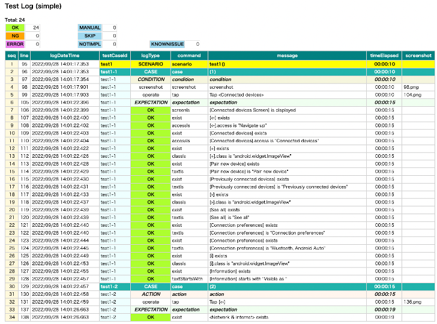

# Creating screen nickname file

Creating screen nickname file is important to make testing easy.

There are several patterns with defining unique screen identity.

1. Fixed layout
2. Scrolling layout with fixed header
3. Scrolling layout without fixed header

The latter is harder than the former.

## Example 1: Fixed layout

Open Android Settings app.

Let's see `[Connected devices Screen]` as example.


1. Create `screens` directory (if it does not exist).
2. Create a file with name `[Connected devices Screen].json`.


3. Edit content as follows. **key** must be the same as the file name(without extension). (
   See [Screen nickname](../../basic/selector_and_nickname/nickname/screen_nickname.md) )

```
{
  "key": "[Connected devices Screen]",

  "identity": "",

  "selectors": {
  }
}
```

4. Capture `Connected Devices` screen in Appium Inspector. (See [Using Appium Inspector](using_appium_inspector.md))
    1. Start appium.
    2. Start Android 12 emulator.
    3. Start Appium Inspector.
    4. Edit capabilities for Android 12 emulator to start session of `Settings` app. Click `Start Session`.
    5. Tap `Connected devices` in the emulator.
    6. Tap `Refresh source & screenshot` in Appium Inspector to capture `Connected devices` screen.
       <br>

5. Look at the screen and define selector names. At this point values may be "" (empty).
   <br>

```
{
  "key": "[Connected devices Screen]",

  "identity": "",

  "selectors": {
    "[<-]": "",
    "[Connected devices]": "",
    "[+]": "",
    "[Pair new device]": "",
    "[Previously connected devices]": "",
    "[>]": "",
    "[See all]": "",
    "[Connection preferences]": "",
    "{Connection preferences}": "",
    "[i]": "",
    "{Information}": ""
  }
}
```

6. Inspect each elements to find unique attribute(s).
   (See [Selector expression](../../basic/selector_and_nickname/selector_expression.md))
    - `[<-]` is filtered uniquely by content-desc '`Navigate up`'.
      <br>
      <br>So you can define the selector as follows using **accessibility filter**.
      <br>```"[<-]": "@Navigate up"```
      <br>
      <br>
    - `[Connected devices]` is filtered uniquely by content-desc '`Connected devices`'.
      <br> 
      <br>So you can define the selector as follows using **accessibility filter**.
      <br>```"[Connected devices]": "@Connected devices"```
      <br>
      <br>
    - `[Pair new device]` is filtered uniquely by text.
      <br> 
      <br>So you can define the selector as follows using **text filter**.
      <br>```"[Pair new device]": "Pair new device"```
      <br>
      <br>In this case, the value can be omitted because the text is the same as nickname label(without brackets). (
      See [Selector nickname](../../basic/selector_and_nickname/nickname/selector_nickname.md))
      <br>```"[Pair new device]": ""```
      <br>
      <br>
    - `[+]` is not filtered uniquely by its attributes.
      <br> 
      <br>In this case, consider
      using [Relative selector](../../basic/selector_and_nickname/relative_selector/relative_selector.md). You
      can define the selector as follows using `:leftImage`.
      See [Relative selector(Direction based)](../../basic/selector_and_nickname/relative_selector/relative_selector_direction.md)
      <br>```"[+]": "[Pair new device]:leftImage"```
      <br>
      <br>
    - `[Connection preferences]` is filtered uniquely by text.
      <br> 
      <br>So you can define the selector as follows using **text filter**.
      <br>```"[Connection preferences]": ""```
      <br>
      <br>
    - `Bluetooth, Android Auto` is dynamic content of `[Connection preferences]`, and is not filtered uniquely by its
      attributes.
      <br> 
      <br>In this case, consider
      using [Relative selector](../../basic/selector_and_nickname/relative_selector/relative_selector.md). You
      can define the selector as follows using `:belowLabel`.
      See [Relative selector(Direction based)](../../basic/selector_and_nickname/relative_selector/relative_selector_direction.md)
      <br>```"{Connection preferences}": "[Connection preferences]:belowLabel"```
      <br>
      <br>
    - Inspect the rest of elements and edit all selector nicknames. Finally, you can get selectors as follows.

```
{
  "key": "[Connected devices Screen]",

  "identity": "",

  "selectors": {
    "[<-]": "@Navigate up",
    "[Connected devices]": "@Connected devices",
    "[+]": "[Pair new device]:leftImage",
    "[Pair new device]": "",
    "[Previously connected devices]": "",
    "[>]": "[See all]:leftImage",
    "[See all]": "",
    "[Connection preferences]": "",
    "{Connection preferences}": "[Connection preferences]:belowLabel",
    "[i]": "{Information}:aboveImage",
    "{Information}": "Visible as *"
  }
}
```

7. Set `identity` combining selector nicknames to make it unique identity.

```
{
  "key": "[Connected devices Screen]",

  "identity": "[Connected devices][Pair new device][See all]",

  "selectors": {
    "[<-]": "@Navigate up",
    "[Connected devices]": "@Connected devices",
    "[+]": "[Pair new device]:leftImage",
    "[Pair new device]": "",
    "[Previously connected devices]": "",
    "[>]": "[See all]:leftImage",
    "[See all]": "",
    "[Connection preferences]": "",
    "{Connection preferences}": "[Connection preferences]:belowLabel",
    "[i]": "{Information}:aboveImage",
    "{Information}": "Visible as *"
  }
}
```

8. Create `ConnectedDevicesTest.kt` under `kotlin/exercise` directory.

```
package exercise

import org.junit.jupiter.api.Test
import shirates.core.configuration.Testrun
import shirates.core.driver.commandextension.*
import shirates.core.testcode.UITest

@Testrun("testConfig/android/androidSettings/testrun.properties")
class ConnectedDevicesTest : UITest() {

    @Test
    fun test1() {

        scenario {
            case(1) {
                condition {
                    it.tap("Connected devices")
                }.expectation {
                    it.screenIs("[Connected devices Screen]")
                        .exist("[<-]").accessIs("Navigate up")
                        .exist("[Connected devices]").accessIs("Connected devices")
                        .exist("[+]").classIs("android.widget.ImageView")
                        .exist("[Pair new device]").textIs("Pair new device")
                        .exist("[Previously connected devices]").textIs("Previously connected devices")
                        .exist("[>]").classIs("android.widget.ImageView")
                        .exist("[See all]").textIs("See all")
                        .exist("[Connection preferences]").textIs("Connection preferences")
                        .exist("{Connection preferences}").textIs("Bluetooth, Android Auto")
                        .exist("[i]").classIs("android.widget.ImageView")
                        .exist("{Information}").textStartsWith("Visible as ")
                }
            }
            case(2) {
                action {
                    it.tap("[<-]")
                }.expectation {
                    it.exist("Network & internet")
                }
            }
        }
    }

}
```

9. Run test. You can get a Html-report as follows when configured correctly.
   <br>

<br>

## Example 2: Scrolling layout with fixed header

Open Android Settings app.

Let's see `[Network & internet Screen]` as example.


This screen is scrollable and has fixed header area `<#collapsing_toolbar>`. In this case, you can define `identity`
as follows.

```
{
  "key": "[Network & internet Screen]",

  "identity": "#collapsing_toolbar&&@Network & internet",
```

This is enough, but you can simply use **title selector**. (
See [title selector](../../basic/selector_and_nickname/special_selector/title_selector.md))

```
{
  "key": "[Network & internet Screen]",

  "identity": "~title=Network & internet",
```

<br>

Screen nickname file for `[Network & internet Screen]` can be described as follows.

**[Network & internet Screen].json**

```
{
  "key": "[Network & internet Screen]",

  "include": [
  ],

  "identity": "~title=Network & internet",

  "selectors": {
    "[<-]": "@Navigate up",
    "[Network & internet]": "@Network & internet",

    "[Internet]": "",
    "{Internet}": "[Internet]:label",

    "[Calls & SMS]": "",
    "{Calls & SMS}": "[Calls & SMS]:label",

    "[SIMs]": "",
    "{SIMs}": "[SIMs]:label",

    "[Airplane mode]": "",
    "{Airplane mode switch}": "[Airplane mode]:switch",

    "[Hotspot & tethering]": "",
    "{Hotspot & tethering}": "[Hotspot & tethering]:label",

    "[Data Saver]": "",
    "{Data Saver}": "[Data Saver]:label",

    "[VPN]": "",
    "{VPN}": "[VPN]:label",

    "[Mobile plan]": "",
    "{Mobile plan}": "[Mobile plan]:label",

    "[Private DNS]": "",
    "{Private DNS}": "[Private DNS]:label",

    "[Adaptive connectivity]": "",
    "{Adaptive connectivity}": "[Adaptive connectivity]:label",

  },

  "scroll": {
    "start-elements": "",
    "end-elements": "[Adaptive connectivity]",
    "overlay-elements": ""
  }
}
```

### :label

In this example, relative selector`:label` is used instead of `:belowLabel`. `:label` searches the nearest label
in widget flow.

See [Relative selector(Widget flow based)](../../basic/selector_and_nickname/relative_selector/relative_selector_flow.md)
.

### :switch

Relative selector `:switch` searches the nearest switch in widget flow.

See [Relative selector(Widget flow based)](../../basic/selector_and_nickname/relative_selector/relative_selector_flow.md)
.

### "scroll" section

`"scroll"` section is for optimization (optional).

`start-elements` and `end-elements` are for detecting end of scroll efficiently.
See [Optimizing end of scroll](../../in_action/performance_resource/end_of_scroll.md)

`overlay-elements` is for detecting overlay elements. Elements under overlay-elements are considered as not displayed.

<br>

## Example 3: Scrolling layout without fixed header

Open Android Settings app.

Let's see `[Android Settings Top Screen]` as example.


1. Open shirates-core project.
2. Open `[Android Settings Top Screen].json` under `testConfig/android/androidSettings/screens`.

```
{
  "key": "[Android Settings Top Screen]",

  "identity": "#recycler_view",
  "satellites": ["Battery", "Accessibility", "Passwords & accounts", "Tips & support"],

  "selectors": {
    "[Account Avatar]": "#account_avatar",
    "[Settings]": "#homepage_title",

    "[Search Button]": "<#search_action_bar>:inner(1)",
    "[Search settings]": "#search_action_bar_title",

    "[Network & internet]": "",
    "{Network & internet}": "[Network & internet]:label",
    "[Network & internet Icon]": "[Network & internet]:leftImage",

    "[Connected devices]": "",
    "{Connected devices}": "[Connected devices]:label",
    "[Connected devices Icon]": "[Connected devices]:leftImage",

    "[Apps]": "",
    "{Apps}": "[Apps]:label",
    "[Apps Icon]": "[Apps]:leftImage",

    "[Notifications]": "",
    "{Notifications}": "[Notifications]:label",
    "[Notifications Icon]": "[Notifications]:leftImage",

    "[Battery]": "",
    "{Battery}": "[Battery]:label",
    "[Battery Icon]": "[Battery]:leftImage",

    "[Storage]": "",
    "{Storage}": "[Storage]:label",
    "[Storage Icon]": "[Storage]:leftImage",

    "[Sound & vibration]": "",
    "{Sound & vibration}": "[Sound & vibration]:label",
    "[Sound & vibration Icon]": "[Sound & vibration]:leftImage",

    "[Display]": "",
    "{Display}": "[Display]:label",
    "[Display Icon]": "[Display]:leftImage",

    "[Wallpaper & style]": "",
    "{Wallpaper & style}": "[Wallpaper & style]:label",
    "[Wallpaper & style Icon]": "[Wallpaper & style]:leftImage",

    "[Accessibility]": "",
    "{Accessibility}": "[Accessibility]:label",
    "[Accessibility Icon]": "[Accessibility]:leftImage",

    "[Security]": "",
    "{Security}": "[Security]:label",
    "[Security Icon]": "[Security]:leftImage",

    "[Privacy]": "",
    "{Privacy}": "[Privacy]:label",
    "[Privacy Icon]": "[Privacy]:leftImage",

    "[Location]": "",
    "{Location}": "[Location]:label",
    "[Location Icon]": "[Location]:leftImage",

    "[Safety & emergency]": "",
    "{Safety & emergency}": "[Safety & emergency]:label",
    "[Safety & emergency Icon]": "[Safety & emergency]:leftImage",

    "[Passwords & accounts]": "",
    "{Passwords & accounts}": "[Passwords & accounts]:label",
    "[Passwords & accounts Icon]": "[Passwords & accounts]:leftImage",

    "[Google]": "",
    "{Google}": "[Google]:label",
    "[Google Icon]": "[Google]:leftImage",

    "[System]": "",
    "{System}": "[System]:label",
    "[System Icon]": "[System]:leftImage",

    "[About emulated device]": "",
    "{About emulated device}": "[About emulated device]:label",
    "[About emulated device Icon]": "[About emulated device]:leftImage",

    "[About phone]": "",
    "{About phone}": "[About phone]:label",
    "[About phone Icon]": "[About phone]:leftImage",

    "[Tips & support]": "",
    "{Tips & support}": "[Tips & support]:label",
    "[Tips & support Icon]": "[Tips & support]:leftImage",

    "[:Summary]": ":belowLabel"
  },

  "scroll": {
    "start-elements": "[Network & internet]",
    "end-elements": "{Tips & support}",
    "overlay-elements": "[Search Button][Search settings]"
  }
}
```

<br>

### "identity" and "satellites"

If you can always access elements that consist of screen identity, you should use these elements for `identity`.
The former **Example 1** and **Example 2** are in this case.

If you can not always access such elements, you should consider another workaround. In case
of `[Android Settings Top Screen]`, you
can scroll up or down.


This screen does not have fixed header area. While scrolling there is no position-fixed element for `"identity"`.
In this case you can use `"satellites"` to complement unique key for screen identification.
`"satellites` is a list of selector.

In `[Android Settings Top Screen].json`, you can specify `"identity"` and `"satellites"` as follows.

```
{
  "key": "[Android Settings Top Screen]",

  "identity": "#recycler_view",
  "satellites": ["Battery", "Accessibility", "Passwords & accounts", "Tips & support"],
...
```

This means that the screen is considered as `"[Android Settings Top Screen]"` when the screen has `"#recycler_view"`
and has at least one of `"Battery"`, `"Accessibility"`
, `"Passwords & accounts"` or `"Tips & support"`. The complex key(consists of identity and satellite key) must be unique
over screens.

### Link

- [Using Appium Inspector](using_appium_inspector.md)
- [index](../../index.md)
