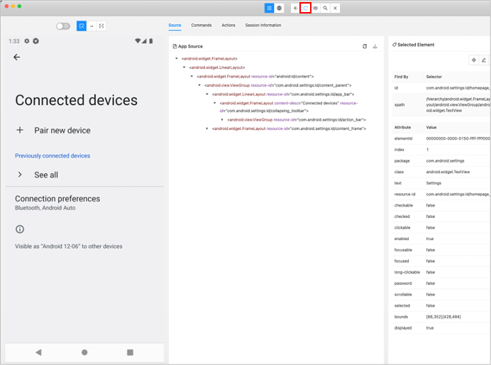
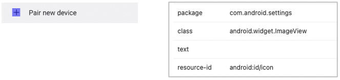
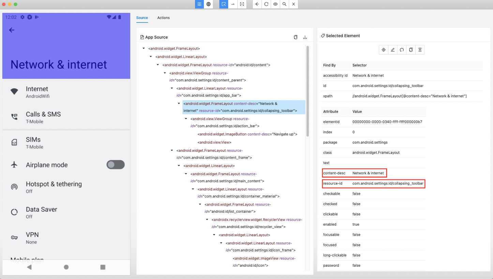
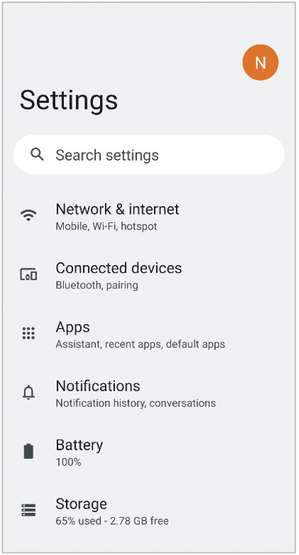

# 画面ニックネームを作成する

画面ニックネームの作成はテストを容易にするために重要です。

ユニークな画面識別子を定義するにはいくつかのパターンがあります。

1. 固定レイアウト
2. スクロールするレイアウト（固定ヘッダあり）
3. スクロールするレイアウト（固定ヘッダなし）

後ろのものの方が難易度は高くなります。

## 例1: 固定レイアウト

Androidの設定アプリを開きます。

`[Connected devices Screen]`の例で説明します。


1. `screens`ディレクトリを作成します(存在していない場合)。
2. `[Connected devices Screen].json`という名前でファイルを作成します。


3. 以下のように内容を編集します。 **key** はファイル名（拡張子なし）と同じにする必要があります。 (
   参照 [画面ニックネーム](../../basic/selector_and_nickname/nickname/screen_nickname_ja.md) )

```
{
  "key": "[Connected devices Screen]",

  "identity": "",

  "selectors": {
  }
}
```

4. Appium Inspectorで`Connected Devices`画面をキャプチャします。 (
   参照 [Appium Inspectorを使用する](using_appium_inspector_ja.md))
    1. appiumを起動します。
    2. Android 12のエミュレーターを起動します。
    3. Appium Inspectorを起動します。
    4. Android 14のエミュレーター向けにcapabilitiesを編集し、`Start Session`をクリックして`設定アプリ`のセッションを開始します。
    5. エミュレーターで`Connected devices`をタップします。
    6. Appium Inspectorで`Refresh source & screenshot`をクリックして`Connected devices`画面をキャプチャします。
       <br>

5. 画面を見ながらセレクターの名前を定義します。この時点では値は""（空文字）でかまいません。
   <br>

```
{
  "key": "[Connected devices Screen]",

  "identity": "",

  "selectors": {
    "[<-]": "",
    "[Connected devices]": "",
    "[+]": "",
    "[Pair new device]": "",
    "[Previously connected devices]": "",
    "[>]": "",
    "[See all]": "",
    "[Connection preferences]": "",
    "{Connection preferences}": "",
    "[i]": "",
    "{Information}": ""
  }
}
```

6. 各要素を精査しユニークな属性を探します。
   (参照 [セレクター式](../../basic/selector_and_nickname/selector_expression_ja.md))
    - `[<-]` は content-descが '`Navigate up`'であるという条件で唯一に決定することができます。
      <br>
      <br>これにより **アクセシビリティフィルター** を使用して以下のようにセレクターを定義できます。
      <br>```"[<-]": "@Navigate up"```
      <br>
      <br>
    - `[Connected devices]`はcontent-descが '`Connected devices`'であるという条件で唯一に決定することができます。
      <br> 
      <br>これにより **アクセシビリティフィルター** を使用して以下のようにセレクターを定義できます。
      <br>```"[Connected devices]": "@Connected devices"```
      <br>
      <br>
    - `[Pair new device]` はテキストによって唯一に決定することができます。
      <br> 
      <br>これにより **テキストフィルター** を使用して以下のようにセレクターを定義できます。
      <br>```"[Pair new device]": "Pair new device"```
      <br>
      <br>この場合、テキストがニックネームから括弧を除いたラベルと一致するので、値の指定は省略できます。 (
      参照 [セレクターニックネーム](../../basic/selector_and_nickname/nickname/selector_nickname_ja.md))
      <br>```"[Pair new device]": ""```
      <br>
      <br>
    - `[+]` は属性値によって唯一に決定することはできません。
      <br> 
      <br>この場合は[相対セレクター](../../basic/selector_and_nickname/relative_selector/relative_selector_ja.md)
      の使用を検討します。
      `:leftImage`を使用するとセレクターを以下のように定義できます。
      参照 [相対セレクター(方向ベース)](../../basic/selector_and_nickname/relative_selector/relative_selector_direction_ja.md)
      <br>```"[+]": "[Pair new device]:leftImage"```
      <br>
      <br>
    - `[Connection preferences]` はテキストによって唯一に決定することができます。
      <br> 
      <br>**テキストフィルター**を使用して以下のようにセレクターを定義できます。
      <br>```"[Connection preferences]": ""```
      <br>
      <br>
    - `Bluetooth, Android Auto` は`[Connection preferences]`の動的なコンテンツであり、その属性によって唯一に決定することはできません。
      <br> 
      <br>この場合は[相対セレクター](../../basic/selector_and_nickname/relative_selector/relative_selector_ja.md)
      の使用を検討します。
      `:belowLabel`を使用するとセレクターを以下のように定義できます。
      参照 [相対セレクター（方向ベース）](../../basic/selector_and_nickname/relative_selector/relative_selector_direction_ja.md)
      <br>```"{Connection preferences}": "[Connection preferences]:belowLabel"```
      <br>
      <br>
    - その他の要素についてもAppium Inspectorで精査し、全てのセレクターニックネームを編集した結果、以下のようなセレクターとなりました。

```
{
  "key": "[Connected devices Screen]",

  "identity": "",

  "selectors": {
    "[<-]": "@Navigate up",
    "[Connected devices]": "@Connected devices",
    "[+]": "[Pair new device]:leftImage",
    "[Pair new device]": "",
    "[Previously connected devices]": "",
    "[>]": "[See all]:leftImage",
    "[See all]": "",
    "[Connection preferences]": "",
    "{Connection preferences}": "[Connection preferences]:belowLabel",
    "[i]": "{Information}:aboveImage",
    "{Information}": "Visible as *"
  }
}
```

7. セレクターニックネームを結合してユニークな識別子を作成して`identity`に設定します。

```
{
  "key": "[Connected devices Screen]",

  "identity": "[Connected devices][Pair new device][See all]",

  "selectors": {
    "[<-]": "@Navigate up",
    "[Connected devices]": "@Connected devices",
    "[+]": "[Pair new device]:leftImage",
    "[Pair new device]": "",
    "[Previously connected devices]": "",
    "[>]": "[See all]:leftImage",
    "[See all]": "",
    "[Connection preferences]": "",
    "{Connection preferences}": "[Connection preferences]:belowLabel",
    "[i]": "{Information}:aboveImage",
    "{Information}": "Visible as *"
  }
}
```

8. `kotlin/exercise`ディレクトリの下に`ConnectedDevicesTest.kt`を作成します。

```
package exercise

import org.junit.jupiter.api.Test
import shirates.core.configuration.Testrun
import shirates.core.driver.commandextension.*
import shirates.core.testcode.UITest

@Testrun("testConfig/android/androidSettings/testrun.properties")
class ConnectedDevicesTest : UITest() {

    @Test
    fun test1() {

        scenario {
            case(1) {
                condition {
                    it.tap("Connected devices")
                }.expectation {
                    it.screenIs("[Connected devices Screen]")
                        .exist("[<-]").accessIs("Navigate up")
                        .exist("[Connected devices]").accessIs("Connected devices")
                        .exist("[+]").classIs("android.widget.ImageView")
                        .exist("[Pair new device]").textIs("Pair new device")
                        .exist("[Previously connected devices]").textIs("Previously connected devices")
                        .exist("[>]").classIs("android.widget.ImageView")
                        .exist("[See all]").textIs("See all")
                        .exist("[Connection preferences]").textIs("Connection preferences")
                        .exist("{Connection preferences}").textIs("Bluetooth, Android Auto")
                        .exist("[i]").classIs("android.widget.ImageView")
                        .exist("{Information}").textStartsWith("Visible as ")
                }
            }
            case(2) {
                action {
                    it.tap("[<-]")
                }.expectation {
                    it.exist("Network & internet")
                }
            }
        }
    }

}
```

9. テストを実行します。正しく設定されている場合は以下のようなHTMLレポートが出力されます。
   <br>

<br>

## 例2: スクロールするレイアウト（固定ヘッダあり）

Androidの設定アプリを起動します。

`[Network & internet Screen]`を例に説明します。




この画面はスクロール可能であり、固定ヘッダとして`<#collapsing_toolbar>`を持ちます。この場合、`identity`を以下のように設定できます。

```
{
  "key": "[Network & internet Screen]",

  "identity": "#collapsing_toolbar&&@Network & internet",
```

これで十分動作しますが、**titleセレクター**を使用するともっと簡単になります。 (
参照 [titleセレクター](../../basic/selector_and_nickname/special_selector/title_selector_ja.md))

```
{
  "key": "[Network & internet Screen]",

  "identity": "~title=Network & internet",
```

<br>

`[Network & internet Screen]`向けの画面ニックネームは以下のように記述することができます。

**[Network & internet Screen].json**

```
{
  "key": "[Network & internet Screen]",

  "include": [
  ],

  "identity": "~title=Network & internet",

  "selectors": {
    "[<-]": "@Navigate up",
    "[Network & internet]": "@Network & internet",

    "[Internet]": "",
    "{Internet}": "[Internet]:label",

    "[Calls & SMS]": "",
    "{Calls & SMS}": "[Calls & SMS]:label",

    "[SIMs]": "",
    "{SIMs}": "[SIMs]:label",

    "[Airplane mode]": "",
    "{Airplane mode switch}": "[Airplane mode]:switch",

    "[Hotspot & tethering]": "",
    "{Hotspot & tethering}": "[Hotspot & tethering]:label",

    "[Data Saver]": "",
    "{Data Saver}": "[Data Saver]:label",

    "[VPN]": "",
    "{VPN}": "[VPN]:label",

    "[Mobile plan]": "",
    "{Mobile plan}": "[Mobile plan]:label",

    "[Private DNS]": "",
    "{Private DNS}": "[Private DNS]:label",

    "[Adaptive connectivity]": "",
    "{Adaptive connectivity}": "[Adaptive connectivity]:label",

  },

  "scroll": {
    "start-elements": "",
    "end-elements": "[Adaptive connectivity]",
    "overlay-elements": ""
  }
}
```

### :label

この例では相対セレクターとして`:belowLabel`ではなく`:label`を使用しています。`:label`はウィジェットフローの最初のlabelを選択します。

参照 [相対セレクター(ウィジェットフローベース)](../../basic/selector_and_nickname/relative_selector/relative_selector_flow_ja.md)
.

### :switch

相対セレクター`:switch`はウィジェットフローの最初のswitchを選択します。

参照 [相対セレクター(ウィジェットフローベース)](../../basic/selector_and_nickname/relative_selector/relative_selector_flow_ja.md)

### "scroll" section

`"scroll"セクションは最適化のために使用します。（オプション）

`start-elements` と `end-elements` はスクロールの終端位置を効率よく検出するためのものです。
参照 [スクロール終端位置の検出の最適化](../../in_action/performance_resource/end_of_scroll_ja.md)

`overlay-elements` はオーバーレイを検出するためのに使用します。 オーバーレイの下にある要素は表示されていないものとみなします。

<br>

## 例3: スクロールするレイアウト（固定ヘッダなし）

Androidの設定アプリを開きます。

`[Android Settings Top Screen]`を例に説明します。



1. shirates-coreプロジェクトを開きます。
2. `testConfig/android/androidSettings/screens`の下にある`[Android Settings Top Screen].json`を開きます。

```
{
  "key": "[Android Settings Top Screen]",

  "identity": "#recycler_view",
  "satellites": [
    "Battery",
    "Accessibility",
    "Passwords & accounts",
    "Tips & support"
  ],

  "selectors": {
    "[Account Avatar]": "#account_avatar",
    "[Settings]": "#homepage_title",

    "[Search Button]": "<#search_action_bar>:inner(1)",
    "[Search settings]": "#search_action_bar_title",

    "[Network & internet]": "",
    "{Network & internet}": "[Network & internet]:label",
    "[Network & internet Icon]": "[Network & internet]:leftImage",

    "[Connected devices]": "",
    "{Connected devices}": "[Connected devices]:label",
    "[Connected devices Icon]": "[Connected devices]:leftImage",

    "[Apps]": "",
    "{Apps}": "[Apps]:label",
    "[Apps Icon]": "[Apps]:leftImage",

    "[Notifications]": "",
    "{Notifications}": "[Notifications]:label",
    "[Notifications Icon]": "[Notifications]:leftImage",

    "[Battery]": "",
    "{Battery}": "[Battery]:label",
    "[Battery Icon]": "[Battery]:leftImage",

    "[Storage]": "",
    "{Storage}": "[Storage]:label",
    "[Storage Icon]": "[Storage]:leftImage",

    "[Sound & vibration]": "",
    "{Sound & vibration}": "[Sound & vibration]:label",
    "[Sound & vibration Icon]": "[Sound & vibration]:leftImage",

    "[Display]": "",
    "{Display}": "[Display]:label",
    "[Display Icon]": "[Display]:leftImage",

    "[Wallpaper & style]": "",
    "{Wallpaper & style}": "[Wallpaper & style]:label",
    "[Wallpaper & style Icon]": "[Wallpaper & style]:leftImage",

    "[Accessibility]": "",
    "{Accessibility}": "[Accessibility]:label",
    "[Accessibility Icon]": "[Accessibility]:leftImage",

    "[Security & privacy]": "",
    "{Security & privacy}": "[Security & privacy]:label",
    "[Security & privacy Icon]": "[Security & privacy]:leftImage",

    "[Location]": "",
    "{Location}": "[Location]:label",
    "[Location Icon]": "[Location]:leftImage",

    "[Safety & emergency]": "",
    "{Safety & emergency}": "[Safety & emergency]:label",
    "[Safety & emergency Icon]": "[Safety & emergency]:leftImage",

    "[Passwords & accounts]": "",
    "{Passwords & accounts}": "[Passwords & accounts]:label",
    "[Passwords & accounts Icon]": "[Passwords & accounts]:leftImage",

    "[Digital Wellbeing & parental controls]": "",
    "{Digital Wellbeing & parental controls}": "[Digital Wellbeing & parental controls]:label",
    "[Digital Wellbeing & parental controls Icon]": "[Digital Wellbeing & parental controls]:leftImage",

    "[Google]": "",
    "{Google}": "[Google]:label",
    "[Google Icon]": "[Google]:leftImage",

    "[System]": "",
    "{System}": "[System]:label",
    "[System Icon]": "[System]:leftImage",

    "[About emulated device]": "",
    "{About emulated device}": "[About emulated device]:label",
    "[About emulated device Icon]": "[About emulated device]:leftImage",

    "[About phone]": "",
    "{About phone}": "[About phone]:label",
    "[About phone Icon]": "[About phone]:leftImage",

    "[Tips & support]": "",
    "{Tips & support}": "[Tips & support]:label",
    "[Tips & support Icon]": "[Tips & support]:leftImage",

    "[:Summary]": ":belowLabel"
  },

  "scroll": {
    "header-elements": "[Search Button][Search settings]",
    "overlay-elements": "",
    "start-elements": "[Network & internet]",
    "end-elements": "{Tips & support}"
  }
}
```

<br>

### "identity" と "satellites"

画面のidentityを構成する要素に常にアクセスできるならば、それらの要素を`identity`として使用すべきです。
上述の**例1** と **例2** がこれに該当します。

そのような要素に常にアクセスできない場合は、他の方法を検討する必要があります。


`[Android Settings Top Screen]`の場合は上下にスクロール可能です。

この画面は固定ヘッダを持っていません。スクロールする際に`"identity"`として使用可能な位置が固定された要素はありません。
この場合、`"satellites"`を指定して画面の識別がユニークになるようにすることができます。
`"satellites`はセレクターのリストです。

`[Android Settings Top Screen].json`においては、`"identity"` と `"satellites"`を以下のように指定することができます。

```
{
  "key": "[Android Settings Top Screen]",

  "identity": "#recycler_view",
  "satellites": ["Battery", "Accessibility", "Passwords & accounts", "Tips & support"],
...
```

これにより、画面が`"#recycler_view"`を持ち、`"Battery"`, `"Accessibility"`, `"Passwords & accounts"` or `"Tips & support"`
のうち
少なくとも一つが画面上に存在している場合、`"[Android Settings Top Screen]"`とみなされます

identity と satellite keyから構成される複合キーが固有である必要があります。

### Link

- [Appium Inspectorを使用する](using_appium_inspector_ja.md)
- [Screen Builderを使用する](using_screen_builder_ja.md)


- [index](../../index_ja.md)
