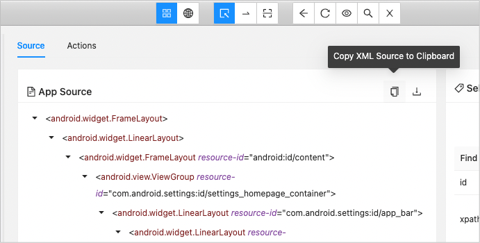
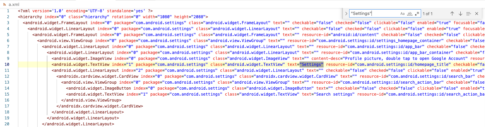

# Using Appium Inspector

When you want to create screen nickname files, use **Appium Inspector** for inspecting element information.

## Install

1. Get install package from [appium/appium-inspector](https://github.com/appium/appium-inspector/releases).
    - `Appium-Inspector-mac-202x.x.x.dmg` (for Mac)
    - `Appium-Inspector-windows-202x.x.x.exe` (for Windows)
2. Install the package.
3. Start Appium Inspector.

## Start Appium Server

1. Open terminal.
2. Start Appium Server process. Type just ```appium``` and enter.

```
wave1008@SNB-M1 ~ % appium
Last login: Sun Apr 14 22:48:21 on ttys003
wave1008@ip-192-168-10-101 ~ % appium
[Appium] Welcome to Appium v2.5.1 (REV 7f745d04d90eaec76c8d5830d6ce6a0d7db888b3)
[Appium] The autodetected Appium home path: /Users/wave1008/.appium
[Appium] Attempting to load driver uiautomator2...
[Appium] Attempting to load driver xcuitest...
[Appium] Requiring driver at /Users/wave1008/.appium/node_modules/appium-uiautomator2-driver/build/index.js
[Appium] Requiring driver at /Users/wave1008/.appium/node_modules/appium-xcuitest-driver/build/index.js
[Appium] AndroidUiautomator2Driver has been successfully loaded in 0.957s
[Appium] XCUITestDriver has been successfully loaded in 2.020s
[Appium] Appium REST http interface listener started on http://0.0.0.0:4723
[Appium] You can provide the following URLs in your client code to connect to this server:
[Appium] 	http://127.0.0.1:4723/ (only accessible from the same host)
[Appium] 	http://192.168.10.101:4723/
[Appium] 	http://10.0.0.101:4723/
[Appium] 	http://192.168.30.10:4723/
[Appium] Available drivers:
[Appium]   - uiautomator2@3.0.4 (automationName 'UiAutomator2')
[Appium]   - xcuitest@7.5.1 (automationName 'XCUITest')
[Appium] No plugins have been installed. Use the "appium plugin" command to install the one(s) you want to use.
```

See [Quick Start](../../quick-start.md) to install appium.

## Start Appium Inspector

1. Start Appium Inspector.
2. Show `Desired Capabilities` tab.
3. Edit parameters as follows.
   <br><br>

```
{
  "appium:automationName": "UiAutomator2",
  "platformName": "Android",
  "appium:platformVersion": "14",
  "appium:appPackage": "com.android.settings",
  "appium:appActivity": "com.android.settings.Settings"
}
```

4. Start `Android 14 emulator`. (For setting up AVD for Android 14, see [Quick Start](../../quick-start.md))
5. Click `[Start Session]`
6. `Settings app` starts in the device. <br>The screen image is captured. You can inspect screen elements.
   <br>

## Finding unique attribute(s)

To identify screen element, unique key information is required. You can use external editor to examine.

1. Capture the screen you want to inspect in Appium Inspector.
2. Click `Copy XML Source to Clipboard`.
   <br>
3. Open your favorite editor and paste it. Now you can search unique attribute(s).
   <br>

### Link

- [Creating screen nickname file](creating_screen_nickname_file.md)
- [Using Screen Builder](using_screen_builder.md)


- [index](../../index.md)
