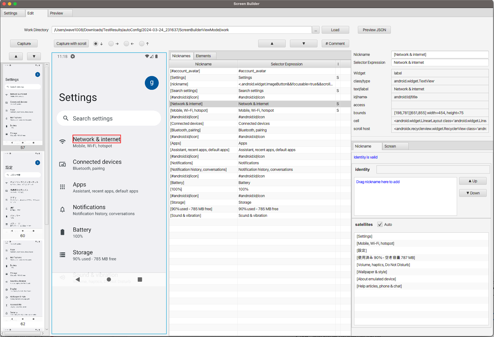
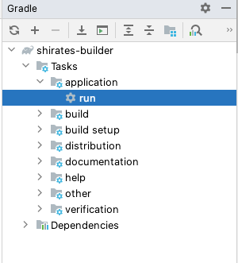
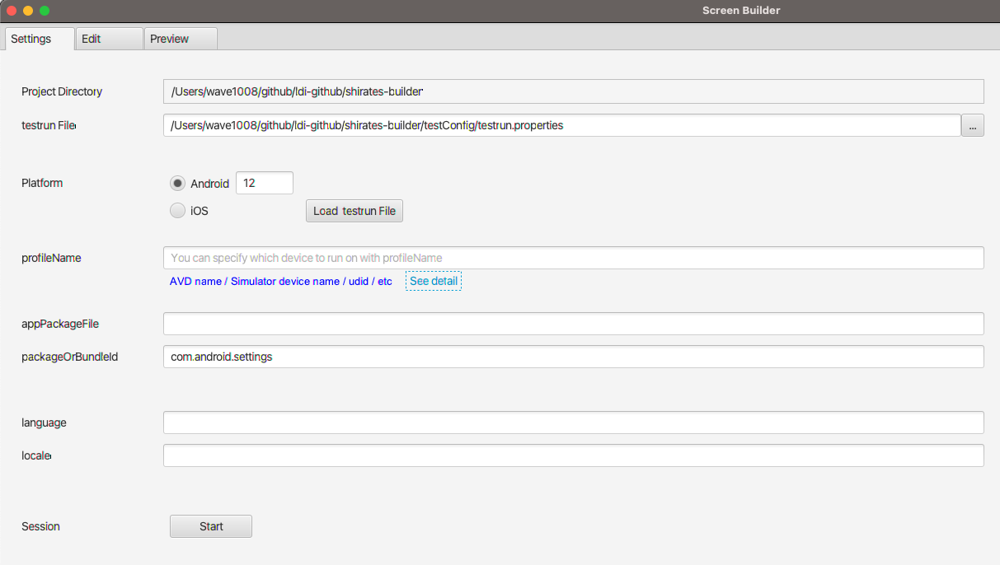
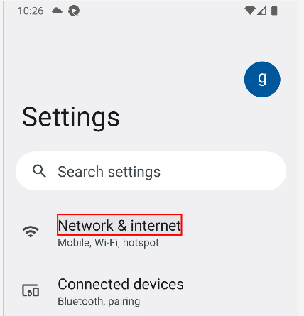
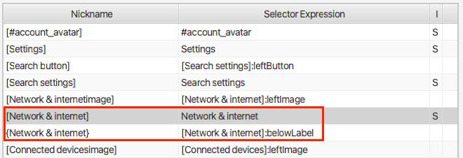

# Screen Builderを使用する

**Screen Builder**を使用すると画面ニックネームファイルの作成が簡単になります。




## Getting Screen Builder (Shirates Builder)

GitHubリポジトリから入手してください。
https://github.com/ldi-github/shirates-builder

```
git clone https://github.com/ldi-github/shirates-builder.git
```

## Screen Builderを起動する

1. `shirates-builder` プロジェクトをIntelliJ IDEAで開きます。
2. Run app.<br>
   

## レコーディングセッションを開始する(Settingsタブ)

1. `testrun File` を設定します。 ドラッグ＆ドロップが使用できます。<br>
   
2. プラットフォームを選択します(Android/iOS)。
3. `[Start]`ボタンをクリックしてエミュレーター/シミュレーターを起動します。

## 画面をキャプチャする(Editタブ)

1. `[Capture]`ボタンまたは`[Capture with scroll]`をクリックします。

## JSONをプレビューする (Previewタブ)

1. Previewタブでプレビューできます。

## ニックネームを定義する

1. イメージ上の要素をクリッkします。フォーカスされて赤色の矩形が表示されます。<br>
   
2. ニックネームを編集できます。<br>
   

## 要素を相対セレクターへ変換する

1. ベース要素をクリックして選択します。(赤色の矩形)
2. 相対セレクターへ変換したい要素をCtrl+クリックします。(緑色の矩形)<br>
    <br>
   `{Network & internet}`が相対セレクターです。
   

### Link

- [画面ニックネームファイルの作成](creating_screen_nickname_file_ja.md)
- [Appium Inspectorを使用する](using_appium_inspector_ja.md)


- [index](../../index_ja.md)
