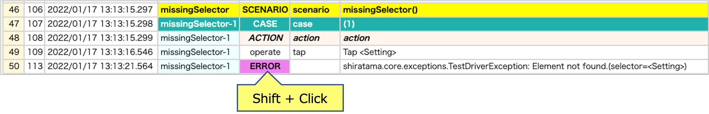
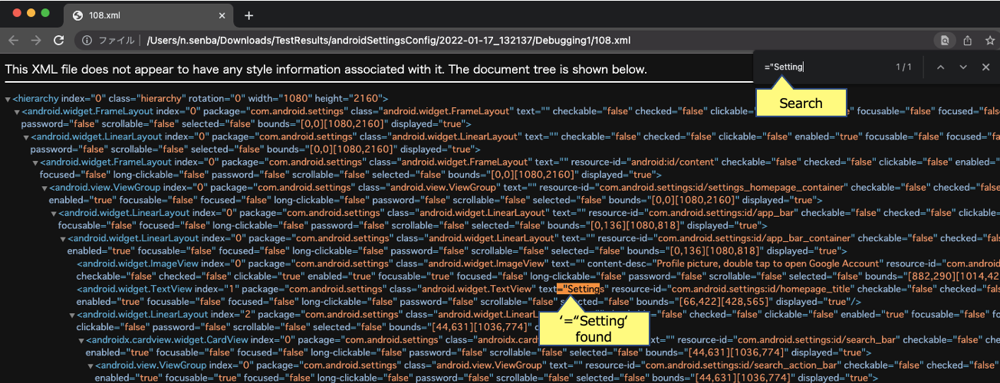

# Watching sourceXML in file

## Example

### Debugging1.kt

(`kotlin/tutorial/inaction/Debugging1.kt`)

```kotlin
@Test
@Order(10)
fun missingSelector_ERROR() {

    scenario {
        case(1) {
            action {
                it.tap("Setting")
            }
        }
    }
}
```

### Console log

```
[ERROR]	()	shirates.core.exception.TestDriverException: Element not found.(selector=<Setting>)
```

### Investigation

1. Open HTML report in TestResults directory.
2. Shift + click on the line you want to get XML information.

   
3. Search keywords.

   

### Cause and solution

Text attribute value that matches "Setting" is not found, but "Settings" found.

Rewrite `it.tap("Setting")` to `it.tap("Settings")`.

### Link

- [index](../../index.md)
