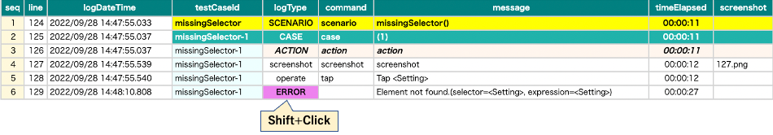

ソースXMLをファイルで確認する

## 例

### Debugging1.kt

(`kotlin/tutorial/inaction/Debugging1.kt`)

```kotlin
@Test
@Order(10)
fun missingSelector_ERROR() {

    scenario {
        case(1) {
            action {
                it.tap("Setting")
            }
        }
    }
}
```

### コンソールログ

```
[ERROR]	()	shirates.core.exception.TestDriverException: Element not found.(selector=<Setting>)
```

### 調査

1. TestResultsにあるHTMLレポートを開きます。
2. 任意の行をShift + clickすると XMLの情報を確認できます。

   
3. キーワードを検索します。

   

### 原因と対策

"Setting"にマッチするtext属性を持つ要素が見つかりません。"Settings"ならあります。

`it.tap("Setting")` を `it.tap("Settings")`に書き換えて修正します。

### Link

- [index](../../index_ja.md)
