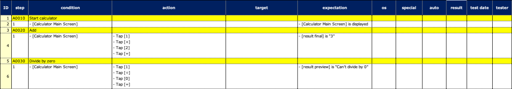

# Designing test in code first

You can design test in code first style.

1. Create test class, then create test functions with `@NoLoadRun` annotation.
2. Implement procedures of tests tentatively.
3. After the app under test is rolled out, remove `@NoLoadRun`, implement tests completely, and run tests.

### CodeFirst1.kt

Create test class, then create test method with `@NoLoadRun` annotation.

```kotlin
@Testrun("testConfig/android/calculator/testrun.properties")
class CodeFirst1 : UITest() {

    @NoLoadRun
    @Test
    @DisplayName("Start calculator")
    fun A0010() {

        scenario {

        }
    }

    @NoLoadRun
    @Test
    @DisplayName("Add")
    fun A0020() {

        scenario {

        }
    }

    @NoLoadRun
    @Test
    @DisplayName("Divide by zero")
    fun A0030() {

        scenario {

        }
    }

}
```

#### Spec-Report


<br>

### CodeFirst2.kt

Implement procedures of tests tentatively.

The macro "[Calculator Main Screen]" is not required to be implemented at this point. The screen nickname
file "[Calculator Main Screen]" also is not required to be implemented at this point.

```kotlin
@Testrun("testConfig/android/calculator/testrun.properties")
class CodeFirst2 : UITest() {

    @NoLoadRun
    @Test
    @DisplayName("Start calculator")
    fun A0010() {

        scenario {
            case(1) {
                condition {
                    it.macro("[Calculator Main Screen]")
                }.expectation {
                    it.screenIs("[Calculator Main Screen]")
                }
            }
        }
    }

    @NoLoadRun
    @Test
    @DisplayName("Add")
    fun A0020() {

        scenario {
            case(1) {
                condition {
                    it.macro("[Calculator Main Screen]")
                }.action {
                    it.tap("[1]")
                        .tap("[+]")
                        .tap("[2]")
                        .tap("[=]")
                }.expectation {
                    it.select("[result final]")
                        .textIs("3")
                }
            }
        }
    }

    @NoLoadRun
    @Test
    @DisplayName("Divide by zero")
    fun A0030() {

        scenario {
            case(1) {
                condition {
                    it.macro("[Calculator Main Screen]")
                }.action {
                    it.tap("[1]")
                        .tap("[÷]")
                        .tap("[0]")
                        .tap("[=]")
                }.expectation {
                    it.select("[result preview]")
                        .textIs("Can't divide by 0")
                }
            }
        }
    }

}
```

You can run test, get Spec-Report as follows at this point.

#### Spec-Report



<br>

### CodeFirst3.kt

After the test target app is rolled out, remove `@NoLoadRun`, implement tests completely, and run tests.

```kotlin
@Testrun("testConfig/android/calculator/testrun.properties")
class CodeFirst3 : UITest() {

    @Test
    @DisplayName("Start calculator")
    fun A0010() {

        scenario {
            case(1) {
                condition {
                    it.macro("[Calculator Main Screen]")
                }.expectation {
                    it.screenIs("[Calculator Main Screen]")
                }
            }
        }
    }

    @Test
    @DisplayName("Add")
    fun A0020() {

        scenario {
            case(1) {
                condition {
                    it.macro("[Calculator Main Screen]")
                }.action {
                    it.tap("[1]")
                        .tap("[+]")
                        .tap("[2]")
                        .tap("[=]")
                }.expectation {
                    it.select("[result final]")
                        .textIs("3")
                }
            }
        }
    }

    @Test
    @DisplayName("Divide by zero")
    fun A0040() {

        scenario {
            case(1) {
                condition {
                    it.macro("[Calculator Main Screen]")
                }.action {
                    it.tap("[1]")
                        .tap("[÷]")
                        .tap("[0]")
                        .tap("[=]")
                }.expectation {
                    it.select("[result preview]")
                        .textIs("Can't divide by 0")
                }
            }
        }
    }

}
```

If tests and the app are implemented correctly, you can get Spec-Report as follows.

#### Spec-Report


### Link

- [index](../../index.md)
