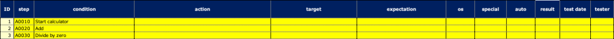
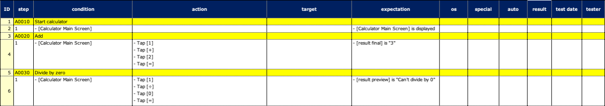
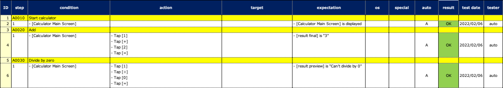

# テストをコードファーストで設計する

コードファーストのスタイルでテストを設計することができます。

1. テストクラスを作成し、`@Manual`アノテーションを付与したテスト関数を作成します。
2. テスト手順を仮実装します。
3. テスト対象のアプリが提供されたら`@Manual`を削除し、テストを実装して完成させ、実行します。

### CodeFirst1.kt

テストクラスを作成し、`@Manual`を付与したテスト関数を作成します。

```kotlin
@Testrun("testConfig/android/calculator/testrun.properties")
class CodeFirst1 : UITest() {

    @Manual
    @Test
    @DisplayName("Start calculator")
    fun A0010() {

        scenario {

        }
    }

    @Manual
    @Test
    @DisplayName("Add")
    fun A0020() {

        scenario {

        }
    }

    @Manual
    @Test
    @DisplayName("Divide by zero")
    fun A0030() {

        scenario {

        }
    }

}
```

#### Spec-Report



<br>

### CodeFirst2.kt

テストの手順を仮実装します。

マクロ"[Calculator Main Screen]"はこの時点では実装する必要はありません。

画面ニックネームファイル"[Calculator Main Screen]"もこの時点では実装する必要はありません。

```kotlin
@Testrun("testConfig/android/calculator/testrun.properties")
class CodeFirst2 : UITest() {

    @Manual
    @Test
    @DisplayName("Start calculator")
    fun A0010() {

        scenario {
            case(1) {
                condition {
                    it.macro("[Calculator Main Screen]")
                }.expectation {
                    it.screenIs("[Calculator Main Screen]")
                }
            }
        }
    }

    @Manual
    @Test
    @DisplayName("Add")
    fun A0020() {

        scenario {
            case(1) {
                condition {
                    it.macro("[Calculator Main Screen]")
                }.action {
                    it.tap("[1]")
                        .tap("[+]")
                        .tap("[2]")
                        .tap("[=]")
                }.expectation {
                    it.select("[result final]")
                        .textIs("3")
                }
            }
        }
    }

    @Manual
    @Test
    @DisplayName("Divide by zero")
    fun A0030() {

        scenario {
            case(1) {
                condition {
                    it.macro("[Calculator Main Screen]")
                }.action {
                    it.tap("[1]")
                        .tap("[÷]")
                        .tap("[0]")
                        .tap("[=]")
                }.expectation {
                    it.select("[result preview]")
                        .textIs("Can't divide by 0")
                }
            }
        }
    }

}
```

この時点でテストを実行すると以下のようなSpec-Reportが出力されます。

#### Spec-Report



<br>

### CodeFirst3.kt

テスト対象のアプリが提供されたら`@Manual`アノテーションを削除し、テストを実装して完成させ、実行します。

```kotlin
@Testrun("testConfig/android/calculator/testrun.properties")
class CodeFirst3 : UITest() {

    @Test
    @DisplayName("Start calculator")
    fun A0010() {

        scenario {
            case(1) {
                condition {
                    it.macro("[Calculator Main Screen]")
                }.expectation {
                    it.screenIs("[Calculator Main Screen]")
                }
            }
        }
    }

    @Test
    @DisplayName("Add")
    fun A0020() {

        scenario {
            case(1) {
                condition {
                    it.macro("[Calculator Main Screen]")
                }.action {
                    it.tap("[1]")
                        .tap("[+]")
                        .tap("[2]")
                        .tap("[=]")
                }.expectation {
                    it.select("[result final]")
                        .textIs("3")
                }
            }
        }
    }

    @Test
    @DisplayName("Divide by zero")
    fun A0040() {

        scenario {
            case(1) {
                condition {
                    it.macro("[Calculator Main Screen]")
                }.action {
                    it.tap("[1]")
                        .tap("[÷]")
                        .tap("[0]")
                        .tap("[=]")
                }.expectation {
                    it.select("[result preview]")
                        .textIs("Can't divide by 0")
                }
            }
        }
    }

}
```

テストとアプリがともに正しく実装されていれば、以下のようなSpec-Reportが出力されます。

#### Spec-Report



### Link

- [index](../../index_ja.md)
