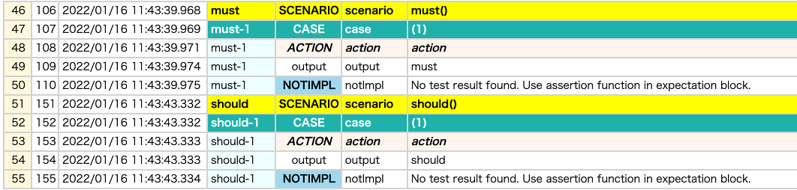

# Filtering by priority (@Must, @Should, @Want )

You can put priority annotations **@Must**,**@Should**,**@Want** on test functions.

## Example

### Priority1.kt

(`kotlin/tutorial/inaction/Priority1.kt`)

```kotlin
package tutorial.inaction

import org.junit.jupiter.api.Order
import org.junit.jupiter.api.Test
import shirates.core.configuration.Testrun
import shirates.core.driver.function.output
import shirates.core.testcode.Must
import shirates.core.testcode.Should
import shirates.core.testcode.UITest
import shirates.core.testcode.Want

@Testrun("testConfig/android/androidSettings/testrun.properties")
class Priority1 : UITest() {

    @Must
    @Order(1)
    @Test
    fun must() {
        scenario {
            case(1) {
                action {
                    output("must")
                }
            }
        }
    }

    @Should
    @Order(2)
    @Test
    fun should() {
        scenario {
            case(1) {
                action {
                    output("should")
                }
            }
        }
    }

    @Want
    @Order(3)
    @Test
    fun want() {
        scenario {
            case(1) {
                action {
                    output("want")
                }
            }
        }
    }

    @Order(4)
    @Test
    fun none() {
        scenario {
            case(1) {
                action {
                    output("none")
                }
            }
        }
    }

}
```

### testrun.properties

You can set filters to determine whether the group should(or should not) be executed when the test executed. Set
priority filter off to skip the priority group. For example, you can set filters as follows.

```
## Priority filter --------------------
want=false
none=false
```

### Result

- must -> executed
- should -> executed
- want -> skipped
- none -> skipped



### Link

- [index](../../index.md)
