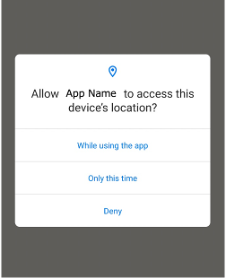

# Irregular Handler (Global Handler)

In smartphone apps, irregular screens are often inserted in the middle of screen transitions.

You may or may not see these screens.

- popup dialog (e.g. Location Permissions, Network Error, Firebase In-App Messaging, ads)
- tutorials to explain how to use features
- notification balloons.
- others



To handle these irregulars, you have to implement conditional branching. That's very annoying.

### AnnoyingEventHandling1.kt

(`kotlin/tutorial/inaction/AnnoyingEventHandling1.kt`)

```kotlin
@Test
@Order(10)
fun annoyingEventHandling1() {

    scenario {
        case(1) {
            condition {
                it.macro("[Some Screen]")
                    .ifCanSelect("While using the app") {
                        it.tap()
                    }
            }.action {
                it.tap("[Button1]")
                    .ifCanSelect("While using the app") {
                        it.tap()
                    }
            }.expectation {
                it.screenIs("[Next Screen]")
            }
        }
    }
}

@Test
@Order(20)
fun annoyingEventHandling2() {

    scenario {
        case(1) {
            condition {
                it.macro("[Some Screen2]")
                    .ifCanSelect("While using the app") {
                        it.tap()
                    }
            }.action {
                it.tap("[Button2]")
                    .ifCanSelect("While using the app") {
                        it.tap()
                    }
            }.expectation {
                it.screenIs("[Next Screen]")
            }
        }
    }
}
```

## irregularHandler

You can centralize irregular handling procedure using **irregularHandler**.

To apply to all test functions in the `TestClass`, override `setEventHandlers` function and set delegate function
to `context.irregularHandler`.

**irregularHandler** is invoked every time on command execution. This mechanism is very powerful and makes the test code
simple.

### IrregularHandler1.kt

(`kotlin/tutorial/inaction/IrregularHandler1.kt`)

```kotlin
@Testrun("testConfig/android/androidSettings/testrun.properties")
class IrregularHandler1 : UITest() {

    override fun setEventHandlers(context: TestDriverEventContext) {

        context.irregularHandler = {
            ifCanSelect("While using the app") {
                it.tap()
            }
        }
    }

    @Test
    @Order(10)
    fun irregularHandler1() {

        scenario {
            case(1) {
                condition {
                    it.macro("[Some Screen]")
                }.action {
                    it.tap("[Button1]")
                }.expectation {
                    it.screenIs("[Next Screen]")
                }
            }
        }
    }

}
```

**Note:**

- A lot of procedure in irregularHandler may cause performance problem. Consider
  using [On Error Handler](on_error_handler.md) or [Screen Handler](screen_handler.md) instead.
- Logging is suppressed while executing irregularHandler delegate function by default.

## suppressHandler

You can suppress firing irregularHandler by using **suppressHandler** function.

```kotlin
@Test
@Order(20)
fun suppressHandler_useHandler() {

    scenario {
        case(1) {
            condition {
                it.macro("[Some Screen]")
            }.action {
                /**
                 * In suppressHandler block,
                 * calling irregular handler is suppressed
                 */
                suppressHandler {
                    it.tap("[Button1]")
                }
            }.expectation {
                it.screenIs("[Next Screen]")
            }
        }
        case(2) {
            action {
                /**
                 * In suppressHandler block,
                 * calling irregular handler is suppressed
                 */
                suppressHandler {
                    it.tap("[Button2]")

                    /**
                     * In useHandler block,
                     * calling irregular handler is enabled
                     * even if it is nested in suppressHandler block
                     */
                    useHandler {
                        it.tap("[Button3]")
                    }
                }
            }
        }
    }
}
```

## disableHandler(), enableHandler()

You can disable or enable handler by these functions.

```kotlin
@Test
@Order(30)
fun disableHandler_EnableHandler() {

    scenario {
        case(1) {
            condition {
                it.macro("[Some Screen]")
            }.action {
                disableHandler()    // Calling irregular handler is disabled.
                it.tap("[Button1]")
                ifCanSelect("While using the app") {
                    it.tap()
                }
                enableHandler()     // Calling irregular handler is enabled again.
            }.expectation {
                it.screenIs("[Next Screen]")
            }
        }
    }
}
```

### Link

- [index](../../index.md)
