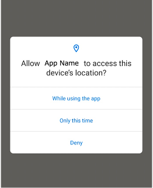

# イレギュラーハンドラー

スマートフォンアプリにおいては画面遷移の中でイレギュラーな画面が挿入されることが頻繁にあります。

以下のような画面が表示されたりされなかったりします。

- ポップアップダイアログ（位置情報許可、ネットワークエラー、Firebase In Appメッセージ、広告）
- 新機能のチュートリアル
- 通知バルーン
- その他



これらのイレギュラーを処理するには、条件分岐を実装する必要があります。これは相当大変な作業です。

### AnnoyingEventHandling1.kt

```kotlin
@Test
@Order(10)
fun annoyingEventHandling1() {

    scenario {
        case(1) {
            condition {
                it.macro("[Some Screen]")
                    .ifCanSelect("While using the app") {
                        it.tap()
                    }
            }.action {
                it.tap("[Button1]")
                    .ifCanSelect("While using the app") {
                        it.tap()
                    }
            }.expectation {
                it.screenIs("[Next Screen]")
            }
        }
    }
}

@Test
@Order(20)
fun annoyingEventHandling2() {

    scenario {
        case(1) {
            condition {
                it.macro("[Some Screen2]")
                    .ifCanSelect("While using the app") {
                        it.tap()
                    }
            }.action {
                it.tap("[Button2]")
                    .ifCanSelect("While using the app") {
                        it.tap()
                    }
            }.expectation {
                it.screenIs("[Next Screen]")
            }
        }
    }
}
```

## イレギュラーハンドラー

**イレギュラーハンドラー** を使用するとイレギュラー処理を一箇所で行うことができます。

テストクラス内の全ての関数に適用するには`setEventHandlers`関数をオーバーライドして`context.irregularHandler`に処理を設定します。

**irregularHandler** はコマンドを実行する時に毎回呼ばれます。この仕組みは非常に便利であり、テストコードをシンプルにします。

### IrregularHandler1

(`kotlin/tutorial/inaction/IrregularHandler1.kt`)

```kotlin
@Testrun("testConfig/android/androidSettings/testrun.properties")
class IrregularHandler1 : UITest() {

    override fun setEventHandlers(context: TestDriverEventContext) {

        context.irregularHandler = {
            ifCanSelect("While using the app") {
                it.tap()
            }
        }
    }

    @Test
    @Order(10)
    fun irregularHandler1() {

        scenario {
            case(1) {
                condition {
                    it.macro("[Some Screen]")
                }.action {
                    it.tap("[Button1]")
                }.expectation {
                    it.screenIs("[Next Screen]")
                }
            }
        }
    }

}
```

**注意:**

- irregularHandler にたくさんの処理を入れるとパフォーマンスの問題を引き起こす可能性があります
- irregularHandlerの処理中はログ出力はデフォルトでは抑制されます

## suppressHandler

**suppressHandler** 関数を使用するとコードブロック内ではirregularHandlerの呼び出しが無効になります。

### IrregularHandler1

(`kotlin/tutorial/inaction/IrregularHandler1.kt`)

```kotlin
@Test
@Order(20)
fun suppressHandler() {

    scenario {
        case(1) {
            condition {
                it.macro("[Some Screen]")
            }.action {
                /**
                 * In suppressHandler block,
                 * calling irregular handler is suppressed
                 */
                suppressHandler {
                    it.tap("[Button1]")
                }
            }.expectation {
                it.screenIs("[Next Screen]")
            }
        }
    }
}
```

## disableHandler, enableHandler

これらの関数を使用してirregularHandlerを無効化したり有効化したりすることができます。

### IrregularHandler1

(`kotlin/tutorial/inaction/IrregularHandler1.kt`)

```kotlin
@Test
@Order(30)
fun disableHandler_EnableHandler() {

    scenario {
        case(1) {
            condition {
                it.macro("[Some Screen]")
            }.action {
                disableHandler()    // Calling irregular handler is disabled.
                it.tap("[Button1]")
                ifCanSelect("While using the app") {
                    it.tap()
                }
                enableHandler()     // Calling irregular handler is enabled again.
            }.expectation {
                it.screenIs("[Next Screen]")
            }
        }
    }
}
```

### Link

- [index](../../index_ja.md)
