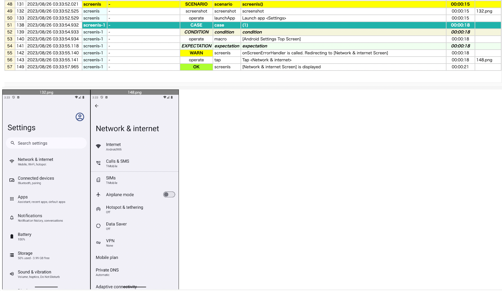

# On Error Handler

You can write irregular handling procedure using these handlers.

| Name                 | Description                                    |   
|----------------------|------------------------------------------------|
| onSelectErrorHandler | called on assertion error in select function   |
| onExistErrorHandler  | called on assertion error in exist function    |
| onScreenErrorHandler | called on assertion error in screenIs function |

### OnSelectErrorHandler1.kt

(`kotlin/tutorial/inaction/OnSelectErrorHandler1.kt`)

```kotlin
package tutorial.inaction

import org.junit.jupiter.api.Order
import org.junit.jupiter.api.Test
import shirates.core.configuration.Testrun
import shirates.core.driver.TestDriverEventContext
import shirates.core.driver.branchextension.ifScreenIs
import shirates.core.driver.commandextension.macro
import shirates.core.driver.commandextension.screenIs
import shirates.core.driver.commandextension.select
import shirates.core.driver.commandextension.tap
import shirates.core.driver.testContext
import shirates.core.logging.printWarn
import shirates.core.testcode.UITest

@Testrun("testConfig/android/androidSettings/testrun.properties")
class OnSelectErrorHandler1 : UITest() {

    override fun setEventHandlers(context: TestDriverEventContext) {

        context.onSelectErrorHandler = {
            ifScreenIs("[Android Settings Top Screen]") {
                printWarn("onSelectErrorHandler is called. Redirecting to [Network & internet Screen]")
                it.tap("Network & internet")
            }
        }
    }

    @Test
    @Order(10)
    fun select() {

        scenario {
            case(1) {
                condition {
                    it.macro("[Android Settings Top Screen]")
                }.action {
                    it.select("Airplane mode")  // onSelectErrorHandler is called
                }.expectation {
                    it.screenIs("[Network & internet Screen]")
                }
            }
        }
    }

    @Test
    @Order(20)
    fun select2() {

        /**
         * You can override the handler
         */
        testContext.onSelectErrorHandler = {
            ifScreenIs("[Android Settings Top Screen]") {
                printWarn("onSelectErrorHandler is called. Redirecting to [Battery Screen]")
                it.tap("Battery")
            }
        }

        scenario {
            case(1) {
                condition {
                    it.macro("[Android Settings Top Screen]")
                }.action {
                    it.select("Battery usage")  // onSelectErrorHandler is called
                }.expectation {
                    it.screenIs("[Battery Screen]")
                }
            }
        }
    }

}
```

### OnExistErrorHandler1.kt

(`kotlin/tutorial/inaction/OnExistErrorHandler1.kt`)

```kotlin
package tutorial.inaction

import org.junit.jupiter.api.Order
import org.junit.jupiter.api.Test
import shirates.core.configuration.Testrun
import shirates.core.driver.TestDriverEventContext
import shirates.core.driver.branchextension.ifScreenIs
import shirates.core.driver.commandextension.exist
import shirates.core.driver.commandextension.macro
import shirates.core.driver.commandextension.screenIs
import shirates.core.driver.commandextension.tap
import shirates.core.logging.printWarn
import shirates.core.testcode.UITest

@Testrun("testConfig/android/androidSettings/testrun.properties")
class OnExistErrorHandler1 : UITest() {

    override fun setEventHandlers(context: TestDriverEventContext) {

        context.onExistErrorHandler = {
            ifScreenIs("[Android Settings Top Screen]") {
                printWarn("onExistErrorHandler is called. Redirecting to [Network & internet Screen]")
                it.tap("Network & internet")
            }
        }
    }

    @Test
    @Order(10)
    fun exist() {

        scenario {
            case(1) {
                condition {
                    it.macro("[Android Settings Top Screen]")
                }.expectation {
                    it.exist("Airplane mode")   // onExistErrorHandler is called
                    it.screenIs("[Network & internet Screen]")
                }
            }
        }
    }

}
```


### OnScreenErrorHandler1.kt

(`kotlin/tutorial/inaction/OnScreenErrorHandler1.kt`)

```kotlin
package tutorial.inaction

import org.junit.jupiter.api.Order
import org.junit.jupiter.api.Test
import shirates.core.configuration.Testrun
import shirates.core.driver.TestDriverEventContext
import shirates.core.driver.branchextension.ifScreenIs
import shirates.core.driver.commandextension.macro
import shirates.core.driver.commandextension.screenIs
import shirates.core.driver.commandextension.tap
import shirates.core.logging.printWarn
import shirates.core.testcode.UITest

@Testrun("testConfig/android/androidSettings/testrun.properties")
class OnScreenErrorHandler1 : UITest() {

    override fun setEventHandlers(context: TestDriverEventContext) {

        context.onScreenErrorHandler = {
            ifScreenIs("[Android Settings Top Screen]") {
                printWarn("onScreenErrorHandler is called. Redirecting to [Network & internet Screen]")
                it.tap("Network & internet")
            }
        }
    }

    @Test
    @Order(10)
    fun screenIs() {

        scenario {
            case(1) {
                condition {
                    it.macro("[Android Settings Top Screen]")
                }.expectation {
                    it.screenIs("[Network & internet Screen]")  // onScreenErrorHandler is called
                }
            }
        }
    }

}
```



### Link

- [index](../../index.md)
