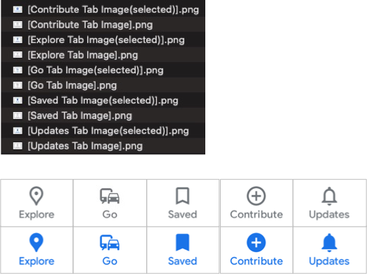

# テンプレートマッチングのための画像を切り出す

**テンプレートマッチング**（画像マッチング）を行うには
事前に画像ファイルを用意する必要があります。
`cropImage`関数を使用すると指定した要素をキャプチャして画像を保存することができます。

## 画像切り出しのサンプル

### CroppingImages1.kt

(`kotlin/tutorial/inaction/CroppingImages1.kt`)

```kotlin
package tutorial.inaction

import org.junit.jupiter.api.Test
import shirates.core.configuration.Testrun
import shirates.core.driver.TestElement
import shirates.core.driver.commandextension.*
import shirates.core.driver.rootElement
import shirates.core.driver.wait
import shirates.core.logging.TestLog
import shirates.core.testcode.UITest
import shirates.core.utility.toPath
import java.nio.file.Files
import java.nio.file.StandardCopyOption

@Testrun("testConfig/android/maps/testrun.properties")
class CroppingImages1 : UITest() {

    @Test
    fun croppingMapsImages() {

        scenario {
            case(1) {
                condition {
                    it.macro("[Maps Top Screen]")
                        .screenIs("[Maps Top Screen]")
                        .wait()     // wait for animation to complete
                }.action {
                    rootElement.cropImage("[Maps Top Screen].png")
                    it.select("[Explore Tab]").cropAndCopy("[Explore Tab Image(selected)].png")
                    it.select("[Contribute Tab]").cropAndCopy("[Contribute Tab Image].png")
                }
            }
            case(2) {
                action {
                    it.tap("[Contribute Tab]")
                        .wait()     // wait for animation to complete
                    it.select("[Contribute Tab]").cropAndCopy("[Contribute Tab Image(selected)].png")
                }
            }
        }
    }

    private fun TestElement.cropAndCopy(fileName: String) {

        this.cropImage(fileName = fileName)

        val targetDir = "testConfig/android/maps/screens/images".toPath()
        if (Files.exists(targetDir).not()) {
            Files.createDirectory(targetDir)
        }
        val source = TestLog.directoryForLog.resolve(fileName)
        val target = targetDir.resolve(fileName)
        Files.copy(source, target, StandardCopyOption.REPLACE_EXISTING)
    }

}
```

### 画像の切り出し

上記のプログラムでは要素を選択して画像を切り出してファイルに保存します。


### 切り出された画像ファイル



### 画像マッチングを使用する

参照 [画像の検証](../../basic/function_property/asserting_image/image_assertion_ja.md)

### Link

- [index](../../index_ja.md)
