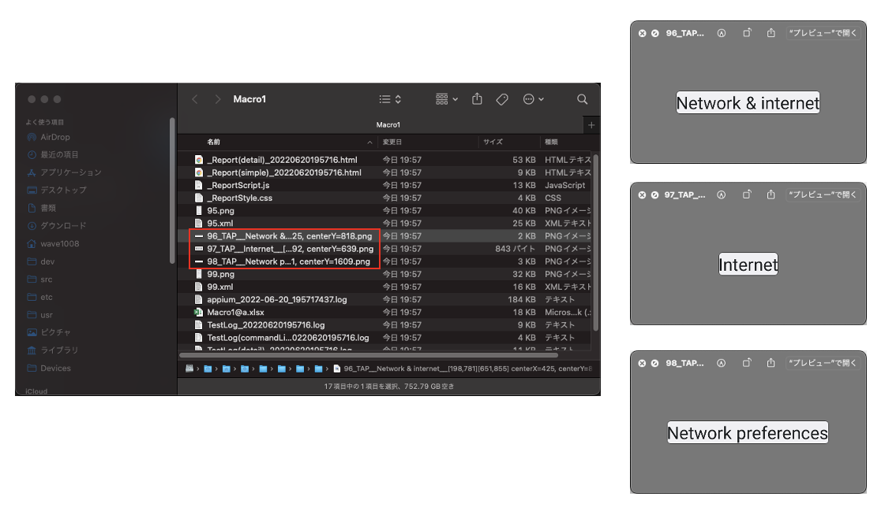

# Configuring log

You can configure log in testrun file.
See also [parameters](../../basic/parameter/parameters.md).

```
## Log --------------------
#logLanguage=ja
#enableSyncLog=false
#enableTestList=false
#enableTestClassList=false
#enableSpecReport=false
#enableInnerMacroLog=true
#enableInnerCommandLog=true
#enableSilentLog=true
#enableTapElementImageLog=true
#enableXmlSourceDump=false
#enableRetryLog=false
#enableWarnOnRetryError=true
#enableGetSourceLog=true
#enableTrace=true
#enableShellExecLog=true
#enableTimeMeasureLog=true
#enableImageMatchDebugLog=true
#testResults=
#testListDir=
```

## Suppress sync log

`enableSyncLog` is true by default. `(syncCache)` is output.

```
95	2022/06/20 17:06:05.013	{test1}	[SCENARIO]	(scenario)	test1()
96	2022/06/20 17:06:05.014	{test1-1}	[CASE]	(case)	(1)
97	2022/06/20 17:06:05.014	{test1-1}	[CONDITION]	(condition)	condition
98	2022/06/20 17:06:05.572	{test1-1}	[screenshot]	(screenshot)	screenshot
99	2022/06/20 17:06:05.574	{test1-1}	[operate]	(tap)	Tap <Network & internet>
100	2022/06/20 17:06:06.305	{test1-1}	[info]	(syncCache)	Syncing (1)
101	2022/06/20 17:06:06.678	{test1-1}	[info]	(syncCache)	elapsed=0.373, syncWaitSeconds=1.8
102	2022/06/20 17:06:07.183	{test1-1}	[info]	(syncCache)	Syncing (2)
103	2022/06/20 17:06:07.263	{test1-1}	[info]	(syncCache)	Synced. (elapsed=0.958, currentScreen=[Network & internet Screen])
104	2022/06/20 17:06:11.255	{test1-1}	[screenshot]	(screenshot)	screenshot
105	2022/06/20 17:06:11.256	{test1-1}	[EXPECTATION]	(expectation)	expectation
```

If you want to disable syncLog, set this parameter to false.

```
enableSyncLog=false
```

```
91	2022/06/20 17:07:46.661	{test1}	[SCENARIO]	(scenario)	test1()
92	2022/06/20 17:07:46.661	{test1-1}	[CASE]	(case)	(1)
93	2022/06/20 17:07:46.661	{test1-1}	[CONDITION]	(condition)	condition
94	2022/06/20 17:07:47.102	{test1-1}	[screenshot]	(screenshot)	screenshot
95	2022/06/20 17:07:47.103	{test1-1}	[operate]	(tap)	Tap <Network & internet>
96	2022/06/20 17:07:52.972	{test1-1}	[screenshot]	(screenshot)	screenshot
97	2022/06/20 17:07:52.973	{test1-1}	[EXPECTATION]	(expectation)	expectation
```

## Enable inner macro log

`enableInnerMacroLog` is false by default. Logs in macro is suppressed.

```
91	2022/06/20 17:16:32.138	{macro1}	[SCENARIO]	(scenario)	macro1()
92	2022/06/20 17:16:32.138	{macro1-1}	[CASE]	(case)	(1)
93	2022/06/20 17:16:32.139	{macro1-1}	[ACTION]	(action)	action
94	2022/06/20 17:16:32.139	{macro1-1}	[operate]	(macro)	[Network preferences Screen]
95	2022/06/20 17:16:32.590	{macro1-1}	[screenshot]	(screenshot)	screenshot
96	2022/06/20 17:16:49.512	{macro1-1}	[screenshot]	(screenshot)	screenshot
97	2022/06/20 17:16:49.513	{macro1-1}	[EXPECTATION]	(expectation)	expectation
98	2022/06/20 17:16:49.515	{macro1-1}	[OK]	(exist)	<Install certificates> exists
```

If you want to see logs in macro, set this parameter to true. This is useful for debugging macro.

```
enableInnerMacroLog=true
```

```
91	2022/06/20 19:11:28.341	{macro1}	[SCENARIO]	(scenario)	macro1()
92	2022/06/20 19:11:28.341	{macro1-1}	[CASE]	(case)	(1)
93	2022/06/20 19:11:28.342	{macro1-1}	[ACTION]	(action)	action
94	2022/06/20 19:11:28.342	{macro1-1}	[operate]	(macro)	[Network preferences Screen]
95	2022/06/20 19:11:28.768	{macro1-1}	[screenshot]	(screenshot)	screenshot
96	2022/06/20 19:11:28.775	{macro1-1}	[operate]	(tap)	Tap <Network & internet>
97	2022/06/20 19:11:34.323	{macro1-1}	[screenshot]	(screenshot)	screenshot
98	2022/06/20 19:11:34.323	{macro1-1}	[operate]	(tap)	Tap <Internet>
99	2022/06/20 19:11:40.774	{macro1-1}	[screenshot]	(screenshot)	screenshot
100	2022/06/20 19:11:40.774	{macro1-1}	[operate]	(tap)	Tap <Network preferences>
101	2022/06/20 19:11:46.174	{macro1-1}	[screenshot]	(screenshot)	screenshot
102	2022/06/20 19:11:46.175	{macro1-1}	[EXPECTATION]	(expectation)	expectation
103	2022/06/20 19:11:46.177	{macro1-1}	[OK]	(exist)	<Install certificates> exists
```

## Enable tap element image log

Set this parameter to true to get the screenshot of the element that was tapped.

```
enableTapElementImageLog=true
```



### Link

- [Configuring screenshot](configuring_screenshot.md)
- [index](../../index.md)

